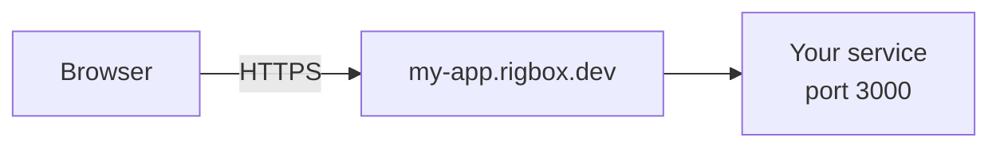
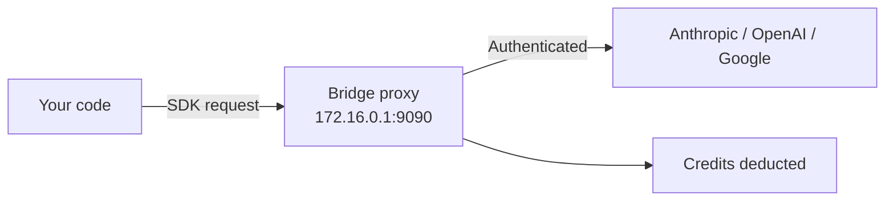
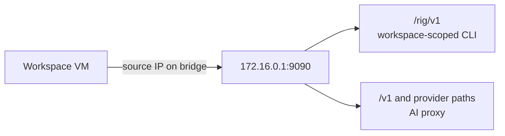

# Architecture

Rigbox separates platform operations from user code. Your workspaces run in isolated micro-VMs that have no access to platform credentials, other users' data, or control plane services.

## Workspace isolation

Each workspace is a [Firecracker](https://firecracker-microvm.github.io/) micro-VM - not a container. This gives you:

- **Dedicated kernel** - each VM boots its own Linux kernel, fully independent from other workspaces
- **Own filesystem** - isolated ext4 disk with no shared volumes
- **Private network** - workspaces cannot communicate with each other directly
- **systemd init** - full Linux userspace with service management
- **No platform secrets** - credentials and internal tokens never enter the VM

Even if code running inside a workspace achieves root access, it is confined to that VM. It cannot reach other workspaces or platform infrastructure.

## App routing

When you expose a port from a workspace, Rigbox creates a public URL with automatic HTTPS:

- Each app gets a unique subdomain: `{name}.rigbox.dev`
- HTTPS termination is automatic - your service only needs to listen on HTTP inside the VM
- Routes are created and removed dynamically as you add or delete apps
- [Visibility controls](/guides/visibility) determine who can access each app (public, private, or privileged)

## AI proxy

The managed AI proxy lets your workspace code call AI providers without holding API keys:

- Provider API keys never enter your VM - the proxy injects them at request time
- Token usage is metered and deducted from your credit balance
- Workspaces discover the proxy through `RIGBOX_AI_PROXY_URL=http://172.16.0.1:9090`
- Provider SDK environment variables are opt-in; source `~/.rigbox/proxy.env` or run `eval "$(rig proxy on)"` inside the VM
- The OpenAI-compatible gateway is available at `/v1`; provider-native routes remain available under `/google`, `/anthropic`, `/openai`, and `/brave` when that managed provider is configured

See [Managed AI Proxy](/guides/managed-proxy) for usage details and [BYOK](/guides/byok) for using your own keys.

## VM-local bridge services

Each running workspace can reach a compute-local bridge service at `http://172.16.0.1:9090`. That service hosts the managed AI proxy and the VM-scoped CLI API used by the baked-in `rig` command.

The bridge does not trust user-supplied workspace IDs as identity. Rigbox resolves the caller from the VM source IP and the compute node that received the request. This keeps VM identity fixed even if code inside the VM edits local files.

## Regions

Workspaces run in specific regions. SSH connections to `{region}.rigbox.dev` (e.g., `eu-west-1.rigbox.dev`) connect directly to the region for lowest latency. The base hostname `rigbox.dev` routes to any region but may add latency depending on your location.

See [SSH Access](/guides/ssh-access) for connection details.

## Learn more

<CardGroup cols={2}>
  <Card title="Security & Isolation" icon="shield" href="/concepts/security">
    Credential protection, access control, and network model
  </Card>
  <Card title="Resource Limits" icon="gauge" href="/concepts/limits">
    Plan tiers, quotas, and rate limits
  </Card>
</CardGroup>
