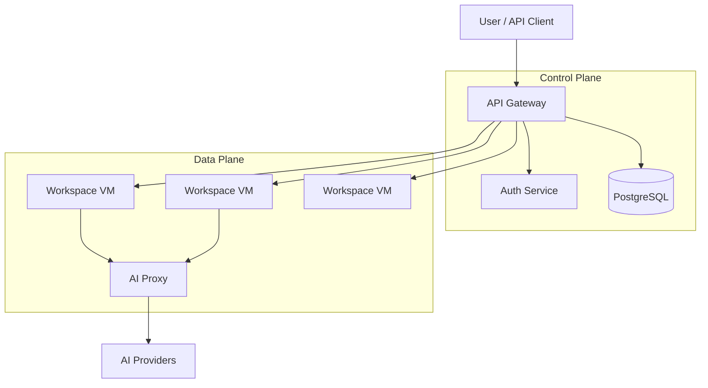
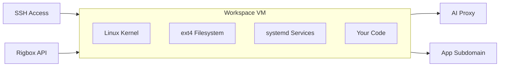
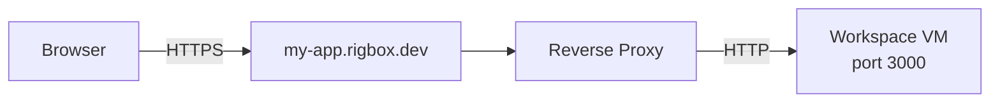
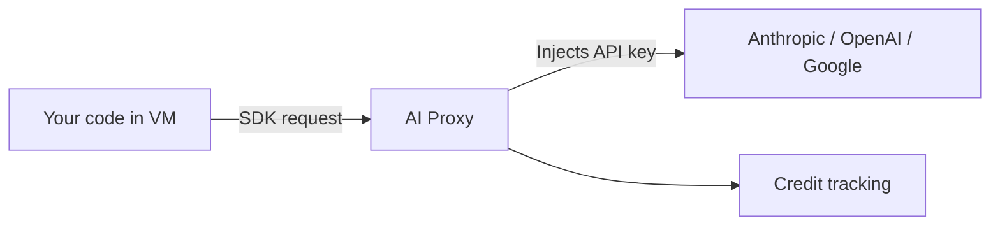

# Architecture

Rigbox uses a two-zone security model where the control plane manages orchestration and secrets, while the data plane runs untrusted code with no access to platform credentials.

## Two-zone model

**Control Plane** holds:
- API gateway — edge routing, rate limiting, request placement
- Auth service — user authentication, API key management, billing
- Database — all platform state (workspaces, apps, users, configs)

**Data Plane** holds:
- Workspace VMs — isolated Firecracker micro-VMs running user code
- AI Proxy — injects provider API keys, enforces credit limits

The two zones communicate over authenticated internal APIs on an encrypted mesh network. Workspace VMs have no access to the database, auth service, or other users' VMs.

## Workspace isolation

Each workspace is a [Firecracker](https://firecracker-microvm.github.io/) micro-VM with:

- **Dedicated kernel** — not a container; each VM boots its own Linux kernel
- **Own filesystem** — isolated ext4 disk, not shared with other workspaces
- **Private network** — internal IP on an isolated network segment
- **systemd init** — full Linux userspace with service management
- **No platform secrets** — API keys, database credentials, and auth tokens never enter the VM

This means even if code running inside a workspace is compromised, it cannot access other workspaces, platform secrets, or the control plane.

## App routing

When you expose a port from a workspace, Rigbox creates a public URL:

- Each app gets a unique subdomain: `{name}.rigbox.dev`
- HTTPS termination is automatic — your service only needs to listen on HTTP
- The reverse proxy dynamically syncs routes as apps are created or deleted
- [Visibility controls](/guides/visibility) determine who can access each app (public, private, or privileged)

## AI proxy

The managed AI proxy sits between workspace VMs and upstream AI providers:

- Provider API keys are held by the proxy and never enter the VM
- The proxy injects the correct key at request time based on the workspace's AI configuration
- Token usage is metered and deducted from the user's credit balance
- The proxy is opt-in per workspace — activate it via the [API](/api-reference/ai/update-workspace-ai-config) or [CLI](/guides/cli) (`rig proxy on`)

See [Managed AI Proxy](/guides/managed-proxy) for usage details.

## Regional deployment

Workspaces run on compute nodes in specific regions. Each region has its own:

- Compute servers running Firecracker VMs
- AI proxy instance
- App routing infrastructure

SSH connections to `{region}.rigbox.dev` (e.g., `eu-west-1.rigbox.dev`) connect directly to the compute node in that region for lowest latency. The gateway at `rigbox.dev` can route to any region but adds a hop.

See [SSH Access](/guides/ssh-access) for connection details.

## Learn more

<CardGroup cols={2}>
  <Card title="Security & Isolation" icon="shield" href="/concepts/security">
    How Rigbox protects your code and credentials
  </Card>
  <Card title="Resource Limits" icon="gauge" href="/concepts/limits">
    Plan tiers, quotas, and rate limits
  </Card>
</CardGroup>
