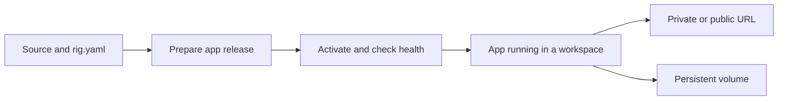

A **workspace** is a Linux micro-VM with its own kernel, filesystem, and resource allocation. An **app** is a service or CLI tool installed inside a workspace. Several apps can share a workspace.

## From source to a running app

`rig.yaml` describes your app. In v0.13, a normal deployment prepares an **app release** in managed directories, then activates it. The workspace stays in place. An **image deployment** instead prepares a frozen workspace environment; use that path when you need to provision system packages or reproduce the entire runtime.

## Choose the right resource

| Resource | Use it for | Recovery boundary |
| --- | --- | --- |
| App release | Source code and application configuration | Rollback does not revert application data |
| Workspace image | Installed runtime and root filesystem | Re-image replaces the workspace root disk |
| Persistent volume | Databases, uploads, and other mutable data | Separate disk; needs its own backup |
| Snapshot | A stopped workspace's root disk | Does not capture attached volumes or memory |
| Recipe | A versioned, reusable application definition | Publishing is separate from deploying |

## Choose your next step

- [Deploy your first app](/quickstart) from a working project.
- [Create a workspace](/guides/workspaces) for an interactive development environment.
- [Compare deployment strategies](/reference/rig-yaml/deployment) before migrating an existing app.
- [Build with the API](/build/overview) when another application will manage Rigbox resources.
