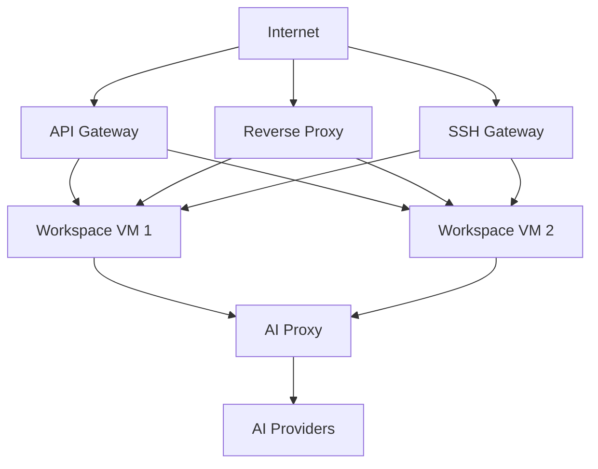

# Security & Isolation

Rigbox is designed to run untrusted code safely. Every workspace is an isolated micro-VM with no access to platform secrets, other users' data, or the control plane.

## VM-level isolation

Each workspace runs in a [Firecracker](https://firecracker-microvm.github.io/) micro-VM - not a container. This means:

| Property | What it means |
| --- | --- |
| **Dedicated kernel** | Each VM boots its own Linux kernel. No kernel sharing between workspaces. |
| **Separate filesystem** | Each VM has its own ext4 disk. No shared volumes or overlays. |
| **Network isolation** | VMs sit on an internal network with no direct access to other VMs or the database. |
| **Process isolation** | Processes in one VM cannot see or signal processes in another. |

Even if code running inside a workspace achieves root access, it is confined to that VM's kernel and filesystem. It cannot reach other workspaces, the API gateway, or the database.

## Credential protection

### Platform secrets

Database credentials, internal auth tokens, provider keys, and service keys are held outside workspace VMs. They never enter the VM.

Each VM receives immutable workspace metadata at `/etc/rigbox/workspace.json`, but that file is not an authentication secret. VM-local Rigbox services authenticate the workspace by the source IP of the VM on the compute node's bridge network, scoped by the compute node ID. In other words, identity is resolved as `(node, VM source IP)`, not by a token that code inside the VM can swap out.

<Note>
  The baked-in `rig` CLI inside a workspace uses this ambient VM identity. It does not require `rig login`, and it does not read your personal `~/.rigbox/config.json` for normal workspace-scoped commands.
</Note>

### AI provider keys

In [managed mode](/guides/managed-proxy), AI provider API keys (Anthropic, OpenAI, Google) are held by the AI proxy service. The proxy injects keys at request time - they never enter the VM. Your code calls the standard SDK endpoint, and the proxy transparently adds authentication.

In [BYOK mode](/guides/byok), you provide your own keys via the AI config API. Keys are stored encrypted and injected into the VM's environment at boot - they are not persisted to disk inside the VM.

### API keys

User API keys use the `rb_` prefix and grant full account access. Best practices:

- Store keys in environment variables or a secrets manager
- Never commit keys to version control
- Use the [API](/api-reference/api-keys/create) to rotate keys regularly
- Use scoped workspace access when possible

## App access control

Every app exposed from a workspace has a [visibility setting](/guides/visibility):

| Mode | Who can access | Use for |
| --- | --- | --- |
| **Private** (default) | Only the workspace owner | Development, testing |
| **Public** | Anyone with the URL | Demos, public APIs, static sites |
| **Privileged** | Owner + specific email addresses | Team collaboration, internal tools |

Access is enforced at the reverse proxy layer - unauthorized requests are blocked before reaching your workspace.

## SSH authentication

SSH access uses public key authentication exclusively. No password authentication is supported.

- Register keys via the [API](/api-reference/ssh-keys/add) or [CLI](/guides/cli) (`rig ssh-key add`)
- Keys are synced to workspace VMs on start and on-demand via the [sync endpoint](/api-reference/ssh-keys/sync-workspace)
- The SSH gateway authenticates your key and routes to your workspace

## Network model

- Workspace VMs are on an internal network - not directly accessible from the internet
- All inbound traffic flows through the API gateway, reverse proxy, or SSH gateway
- VM-local Rigbox services are exposed only on the compute bridge (`172.16.0.1:9090`) and resolve callers from node-scoped VM IP leases
- Outbound AI requests can flow through the managed proxy (when enabled)
- VMs can make outbound HTTP requests to the public internet for package installation, git clones, etc.

## Rate limiting

API requests are rate-limited per user to prevent abuse. Limits vary by endpoint class:

| Endpoint class | Default limit |
| --- | --- |
| Authentication | 120 requests/min |
| Workspaces | 180 requests/min |
| Apps | 240 requests/min |

If you exceed the limit, the API returns `429 Too Many Requests`. Retry with exponential backoff.

See [Resource Limits](/concepts/limits) for plan-level quotas.

## Learn more

<CardGroup cols={2}>
  <Card title="Architecture" icon="sitemap" href="/concepts/architecture">
    How the two-zone model works
  </Card>
  <Card title="App Visibility" icon="eye" href="/guides/visibility">
    Control who can access your apps
  </Card>
</CardGroup>
