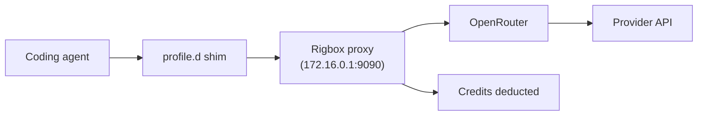

# AI Coding Tools

Rigbox workspaces come with a full Linux environment, SSH access, and a managed AI proxy — making them a natural home for AI coding agents. Tools like Claude Code, Codex CLI, OpenCode, and Kilocode can use Rigbox credits without ever seeing a provider API key.

## How It Works

Managed workspaces expose `OPENROUTER_BASE_URL` and `OPENROUTER_API_KEY` to every login shell. The bridge-local proxy at `172.16.0.1:9090` fronts OpenRouter, which in turn routes to the appropriate upstream provider for whatever model you ask for. Your credits cover the usage; provider API keys stay outside the VM.

The four catalog recipes — `claude`, `codex`, `opencode`, `kilocode` — each ship a small `/etc/profile.d/*-routing.sh` shim that translates `OPENROUTER_*` into whatever env vars that particular agent prefers (Anthropic shape for Claude Code, OpenAI shape for Codex, the native OpenRouter env vars for OpenCode, and the Kilo provider env vars for Kilocode). You don't need to know which one you're getting — install the recipe and it just works.



## Supported Tools

| Tool | Catalog recipe | Provider | What it does |
|------|----------------|----------|-------------|
| [Claude Code](https://claude.ai/code) | `claude` | Anthropic | Agentic coding assistant that edits files, runs commands, and manages git. Uses the `/v1/messages` Anthropic passthrough. |
| [Codex CLI](https://github.com/openai/codex) | `codex` | OpenAI | Terminal-based AI agent for code generation and refactoring. |
| [OpenCode](https://github.com/sst/opencode) | `opencode` | Any (via OpenRouter) | Open-source terminal coding agent. |
| [Kilo Code](https://kilocode.ai) | `kilocode` | Any (via OpenRouter) | Terminal-first agent with planner / executor split. |
| [Gemini CLI](https://github.com/google-gemini/gemini-cli) | — | Google | Google's terminal AI assistant. Install manually with `npm`. |
| [Aider](https://aider.chat) | — | Any | AI pair programming in your terminal. Install manually with `pip`. |

## Quick Setup

### Recommended: install via the catalog

For the four supported recipes, one call is all you need:

```bash
rig catalog install claude     # or: codex, opencode, kilocode
```

This drops the binary into `$PATH`, writes the per-agent routing shim into `/etc/profile.d/`, and exits — there's no service to wait on. SSH into the workspace and invoke the agent directly. See [Catalog Apps → CLI-shape recipes](/guides/catalog#cli-shape-catalog-reference) for the routing details and equivalent API call.

### Manual install (for tools without a catalog recipe)

For Gemini CLI and Aider, install the package yourself:

<CodeGroup>

```bash Gemini CLI
npm install -g @google/gemini-cli
```

```bash Aider
pip install aider-chat
```

</CodeGroup>

Managed workspaces export `OPENROUTER_BASE_URL` and `OPENROUTER_API_KEY` at login, so most OpenRouter-aware tools just work. For tools that prefer provider-native env vars (e.g.&nbsp;`ANTHROPIC_BASE_URL`, `OPENAI_BASE_URL`), run `eval "$(rig proxy on)"` to print compatibility exports for your current shell.

### Start coding

<CodeGroup>

```bash Claude Code
claude
```

```bash Codex CLI
codex "refactor this function to use async/await"
```

```bash OpenCode
opencode
```

```bash Kilo Code
kilocode
```

```bash Gemini CLI
gemini
```

```bash Aider
aider
```

</CodeGroup>

<Tip>
Use the `dev` or `full` image for AI coding tools. They include build toolchains that coding agents often need (compilers, linters, test runners).
</Tip>

## Tool-Specific Setup

### Claude Code

`rig catalog install claude` writes a `profile.d` shim that points `ANTHROPIC_BASE_URL` at the proxy's `/v1/messages` Anthropic passthrough and sets `ANTHROPIC_API_KEY` to a managed placeholder. After SSH-ing in, just run:

```bash
claude
```

Claude Code can edit files, run shell commands, manage git, and run tests inside the workspace. Since each workspace is an isolated VM, there's no risk of the agent affecting other projects.

<Note>
Claude Code uses Claude Sonnet by default. To use Opus, pass `--model claude-opus-4-20250514`. Credit consumption is higher for Opus.
</Note>

### Codex CLI

`rig catalog install codex` configures the agent to route through OpenAI-shape requests to OpenRouter, picking up `OPENAI_BASE_URL` / `OPENAI_API_KEY` from the routing shim:

```bash
codex "add error handling to the API routes in src/routes/"
```

### OpenCode

OpenCode reads `OPENROUTER_API_KEY` natively, so the catalog install only needs to drop the binary in place:

```bash
opencode
```

### Kilo Code

`rig catalog install kilocode` writes a shim that maps `OPENROUTER_*` to the `KILO_*` environment variables the agent expects:

```bash
kilocode
```

### Gemini CLI

Gemini CLI doesn't have a catalog recipe yet — install with `npm install -g @google/gemini-cli`. It reads `GOOGLE_API_KEY` or a configured base URL from the environment; run `eval "$(rig proxy on)"` to export equivalent variables in your current shell, then start the agent:

```bash
eval "$(rig proxy on)"
gemini
```

### Aider

Aider supports multiple providers and reads provider-native env vars. Run `rig proxy on` first to export them, then choose a model:

```bash
eval "$(rig proxy on)"

# Use with Anthropic
aider --model claude-sonnet-4-20250514

# Use with OpenAI
aider --model gpt-4o

# Use with Google
aider --model gemini/gemini-2.5-pro
```

## Automate with Setup Scripts

If you want every new workspace to come pre-loaded with a coding agent, attach a [setup script](/guides/setup-scripts) that calls the catalog (preferred — it picks up the routing shim) or installs the package directly:

```bash
#!/bin/bash
# One-line catalog install (uses the workspace's RIGBOX_API_KEY)
rig catalog install claude

# Or, for tools without a catalog recipe:
pip install aider-chat
```

## Monitor Credit Usage

AI coding tools can consume credits quickly - especially agentic tools that make many API calls in a loop. Monitor your balance:

```bash
curl -s https://api.rigbox.dev/api/v1/users/me/credits \
  -H "Authorization: Bearer $RIGBOX_TOKEN" | jq .
```

Or from inside the workspace:

```bash
rig status
```

<Warning>
Agentic tools like Claude Code and Codex can make dozens of API calls per task. A single complex refactoring session might use 50-200 credits depending on the model and codebase size. Monitor your balance if you're on the free tier.
</Warning>

## BYOK Alternative

If you burn through managed credits quickly, switch to [BYOK mode](/guides/byok) and use your own API keys for unlimited usage:

```bash
curl -X PUT https://api.rigbox.dev/api/v1/workspaces/{workspace_id}/ai-config \
  -H "Authorization: Bearer $RIGBOX_TOKEN" \
  -H "Content-Type: application/json" \
  -d '{"mode": "byok", "provider": "anthropic", "api_key": "sk-ant-..."}'
```

Then run `eval "$(rig proxy on)"` again to update the environment.

## Why Rigbox for AI Coding

| Benefit | Detail |
|---------|--------|
| **Isolated environment** | Agents can run commands, install packages, and modify files without affecting your local machine |
| **No key management** | Managed credits mean zero API key configuration |
| **Full Linux VM** | Build tools, compilers, databases - everything agents need is available |
| **SSH access** | Work alongside the agent: SSH in to review changes, run tests, or pair-program |
| **Snapshots** | [Snapshot](/guides/snapshots) before a big refactor, restore if the agent goes sideways |

## Next Steps

- [Managed AI Proxy](/guides/managed-proxy) - how the OpenRouter-backed proxy and credit system work in detail
- [App Catalog → CLI-shape recipes](/guides/catalog#cli-shape-catalog-reference) - what each recipe installs and how the routing shims translate env vars
- [Rigbox CLI](/guides/cli) - manage workspaces, apps, and recipes from the terminal
- [Bring Your Own Keys](/guides/byok) - use your own API keys for unlimited usage
- [Setup Scripts](/guides/setup-scripts) - automate tool installation across workspaces
- [Images & Templates](/guides/images-and-templates) - choose the right base image for coding
