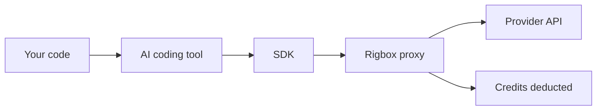

# AI Coding Tools

Rigbox workspaces come with a full Linux environment, SSH access, and a managed AI proxy - making them a natural home for AI coding agents. Tools like Claude Code, Codex CLI, OpenCode, and Gemini CLI can use Rigbox credits when the matching managed provider is available.

## How It Works

AI coding tools use the same provider SDKs (Anthropic, OpenAI, Google) that the managed proxy exposes. When you run `eval "$(rig proxy on)"` inside a workspace, `rig` sets environment variables for the current shell that redirect SDK traffic through Rigbox's bridge proxy. Your credits cover the usage; provider API keys stay outside the VM.



## Supported Tools

| Tool | Provider | What it does |
|------|----------|-------------|
| [Claude Code](https://claude.ai/code) | Anthropic | Agentic coding assistant that edits files, runs commands, and manages git |
| [Codex CLI](https://github.com/openai/codex) | OpenAI | Terminal-based AI agent for code generation and refactoring |
| [OpenCode](https://github.com/opencode-ai/opencode) | Any | Open-source terminal coding agent, supports multiple providers |
| [Gemini CLI](https://github.com/google-gemini/gemini-cli) | Google | Google's terminal AI assistant for code and shell tasks |
| [Aider](https://aider.chat) | Any | AI pair programming in your terminal |

## Quick Setup

### 1. Activate managed credits

From inside your workspace:

```bash
eval "$(rig proxy on)"
```

This sets the environment variables each SDK needs (`ANTHROPIC_BASE_URL`, `OPENAI_BASE_URL`, etc.) to route through the Rigbox proxy.

### 2. Install your preferred tool

<CodeGroup>

```bash Claude Code
npm install -g @anthropic-ai/claude-code
```

```bash Codex CLI
npm install -g @openai/codex
```

```bash Gemini CLI
npm install -g @anthropic-ai/gemini-cli
```

```bash Aider
pip install aider-chat
```

```bash OpenCode
go install github.com/opencode-ai/opencode@latest
```

</CodeGroup>

### 3. Start coding

The tools pick up the proxy environment variables automatically. The placeholder API keys are set to `managed-by-rigbox`; the proxy ignores that placeholder and injects server-side managed keys upstream.

<CodeGroup>

```bash Claude Code
claude
```

```bash Codex CLI
codex "refactor this function to use async/await"
```

```bash Gemini CLI
gemini
```

```bash Aider
aider
```

</CodeGroup>

<Tip>
Use the `dev` or `full` image for AI coding tools. They include build toolchains that coding agents often need (compilers, linters, test runners).
</Tip>

## Tool-Specific Setup

### Claude Code

Claude Code can use the proxy after `rig proxy on` when Anthropic is configured for managed routing. It reads `ANTHROPIC_BASE_URL` from the environment.

```bash
eval "$(rig proxy on)"
claude
```

Claude Code can edit files, run shell commands, manage git, and run tests inside the workspace. Since each workspace is an isolated VM, there's no risk of the agent affecting other projects.

<Note>
Claude Code uses Claude Sonnet by default. To use Opus, pass `--model claude-opus-4-20250514`. Credit consumption is higher for Opus.
</Note>

### Codex CLI

Codex reads `OPENAI_BASE_URL` from the environment. In Rigbox, that points at the OpenAI-compatible `/v1` gateway. If the current environment does not have a managed OpenAI key configured, `/v1` returns `503 provider_unavailable`; use a configured provider path or BYOK instead.

```bash
eval "$(rig proxy on)"
codex "add error handling to the API routes in src/routes/"
```

### Gemini CLI

Gemini CLI reads `GOOGLE_API_KEY` or the configured base URL from the environment.

```bash
eval "$(rig proxy on)"
gemini
```

### Aider

Aider supports multiple providers. The proxy environment variables are picked up automatically.

```bash
eval "$(rig proxy on)"

# Use with Anthropic (default after proxy on)
aider --model claude-sonnet-4-20250514

# Use with OpenAI
aider --model gpt-4o

# Use with Google
aider --model gemini/gemini-2.5-pro
```

### OpenCode

OpenCode uses the same SDK environment variables. Configure it to use your preferred provider.

```bash
eval "$(rig proxy on)"
opencode
```

## Automate with Setup Scripts

If you regularly use AI coding tools, create a [setup script](/guides/setup-scripts) that installs them automatically on workspace boot:

```bash
#!/bin/bash
# Install AI coding tools
npm install -g @anthropic-ai/claude-code
pip install aider-chat
```

Attach this script to your workspace or template so every new workspace comes pre-configured.

## Monitor Credit Usage

AI coding tools can consume credits quickly - especially agentic tools that make many API calls in a loop. Monitor your balance:

```bash
curl -s https://api.rigbox.dev/api/users/me/credits \
  -H "Authorization: Bearer $RIGBOX_TOKEN" | jq .
```

Or from inside the workspace:

```bash
rig status
```

<Warning>
Agentic tools like Claude Code and Codex can make dozens of API calls per task. A single complex refactoring session might use 50-200 credits depending on the model and codebase size. Monitor your balance if you're on the free tier.
</Warning>

## BYOK Alternative

If you burn through managed credits quickly, switch to [BYOK mode](/guides/byok) and use your own API keys for unlimited usage:

```bash
curl -X PUT https://api.rigbox.dev/api/workspaces/{workspace_id}/ai-config \
  -H "Authorization: Bearer $RIGBOX_TOKEN" \
  -H "Content-Type: application/json" \
  -d '{"mode": "byok", "provider": "anthropic", "api_key": "sk-ant-..."}'
```

Then run `eval "$(rig proxy on)"` again to update the environment.

## Why Rigbox for AI Coding

| Benefit | Detail |
|---------|--------|
| **Isolated environment** | Agents can run commands, install packages, and modify files without affecting your local machine |
| **No key management** | Managed credits mean zero API key configuration |
| **Full Linux VM** | Build tools, compilers, databases - everything agents need is available |
| **SSH access** | Work alongside the agent: SSH in to review changes, run tests, or pair-program |
| **Snapshots** | [Snapshot](/guides/snapshots) before a big refactor, restore if the agent goes sideways |

## Next Steps

- [Managed AI Proxy](/guides/managed-proxy) - how the proxy and credit system works in detail
- [Bring Your Own Keys](/guides/byok) - use your own API keys for unlimited usage
- [Setup Scripts](/guides/setup-scripts) - automate tool installation across workspaces
- [Images & Templates](/guides/images-and-templates) - choose the right base image for coding
