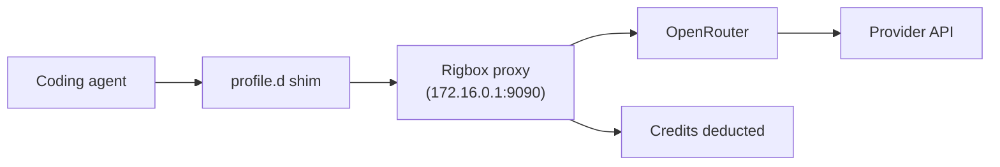

Rigbox workspaces come with a full Linux environment, SSH access, and a managed AI proxy — making them a natural home for AI coding agents. Tools like Claude Code, Codex CLI, OpenCode, Kilo Code, Junie, and Pi can use Rigbox credits without ever seeing a provider API key.

## Before you begin

Use the [v0.13 CLI](/guides/install-cli) and [authenticate](/cli-reference/authentication). Run workspace-management and recipe commands from your local terminal. Commands identified as running inside a workspace require its console terminal or SSH session. Replace example resource IDs with the values returned for your account.

Start the target workspace first and verify its identity with `rig workspace ls`. AI calls require managed credits or an appropriately configured provider account.

## How It Works

Managed workspaces expose `OPENROUTER_BASE_URL` and `OPENROUTER_API_KEY` to every login shell. The bridge-local proxy at `172.16.0.1:9090` fronts OpenRouter, which in turn routes to the appropriate upstream provider for whatever model you ask for. Your credits cover the usage; provider API keys stay outside the VM.

The built-in coding agents — `claude`, `codex`, `opencode`, `kilocode`, `junie`, and `pi` — each come with a small `/etc/profile.d/` script that hands those settings to the agent in the form it expects: Anthropic variables for Claude Code, OpenAI variables for Codex, the Kilo and Junie provider variables for Kilo Code and Junie, while OpenCode and Pi read the OpenRouter variables directly. Install the agent and start it; there is nothing else to configure. Claude Code's script steps aside when you use your own Claude login or key.


```mermaid
flowchart LR
    A[Coding agent] --> B[profile.d shim]
    B --> C["Rigbox proxy
(172.16.0.1:9090)"]
    C --> D[OpenRouter]
    D --> E[Provider API]
    C --> F[Credits deducted]
```

## Supported Tools

| Tool | Catalog ID | Provider | What it does |
|------|------------|----------|-------------|
| [Claude Code](https://claude.ai/code) | `claude` | Anthropic | Agentic coding assistant that edits files, runs commands, and manages git. Uses the `/v1/messages` Anthropic passthrough. |
| [Codex CLI](https://github.com/openai/codex) | `codex` | OpenAI | Terminal-based AI agent for code generation and refactoring. |
| [OpenCode](https://github.com/sst/opencode) | `opencode` | Any (via OpenRouter) | Open-source terminal coding agent. |
| [Kilo Code](https://kilocode.ai) | `kilocode` | Any (via OpenRouter) | Terminal-first agent with planner / executor split. |
| [Junie](https://www.jetbrains.com/junie/) | `junie` | Any (via OpenRouter) | JetBrains' coding agent for the terminal. |
| Pi | `pi` | Any (via OpenRouter) | Terminal coding agent that reads OpenRouter settings natively. |
| [Gemini CLI](https://github.com/google-gemini/gemini-cli) | — | Google | Google's terminal AI assistant. Install manually with `npm`. |
| [Aider](https://aider.chat) | — | Any | AI pair programming in your terminal. Install manually with `pip`. |

## Quick Setup

### Recommended: install via the catalog

Add an agent to a workspace that already exists by its catalog ID:

```bash
rig recipe app install --ref claude --workspace <WORKSPACE_NAME>     # or: codex, opencode, kilocode, junie, pi
```

The command starts the install and returns; the agent is ready when the install finishes. It prints the app it created; to follow the install, run `rig app logs --app <APP_NAME> --install`. The full ref `@rigbox/claude@builtin` works too. Inside the workspace itself, pass the workspace's own name to `--workspace`.

To create a workspace with agents already installed, name them when you create it:

```bash
rig workspace spawn --name <WORKSPACE_NAME> --template dev --catalog claude --catalog codex
```

Each agent installs its executable on `$PATH` and its routing script in `/etc/profile.d/`. There is no service to start: SSH into the workspace and run the agent. See [Catalog Apps → CLI-shape recipes](/guides/catalog#cli-shape-catalog-reference) for the routing details and equivalent API call.

### Manual install (for tools without a catalog recipe)

For Gemini CLI and Aider, install the package yourself:

<CodeGroup>

```bash Gemini CLI
npm install -g @google/gemini-cli
```

```bash Aider
pip install aider-chat
```

</CodeGroup>

Managed workspaces export `OPENROUTER_BASE_URL` and `OPENROUTER_API_KEY` at login, so most OpenRouter-aware tools just work. For OpenAI-compatible tools that read `OPENAI_BASE_URL` and `OPENAI_API_KEY` instead, run `eval "$(rig proxy on)"` to set them for your current shell. Anthropic clients take the proxy root, `http://172.16.0.1:9090`, as their base URL; see [base URLs](/guides/managed-proxy#base-urls-for-clients).

### Start coding

<CodeGroup>

```bash Claude Code
claude
```

```bash Codex CLI
codex "refactor this function to use async/await"
```

```bash OpenCode
opencode
```

```bash Kilo Code
kilocode
```

```bash Junie
junie
```

```bash Pi
pi
```

```bash Gemini CLI
gemini
```

```bash Aider
aider
```

</CodeGroup>

<Tip>
Use the `dev` or `full` image for AI coding tools. They include build toolchains that coding agents often need (compilers, linters, test runners).
</Tip>

## Tool-Specific Setup

### Claude Code

`rig recipe app install --ref claude` installs Claude Code and a routing script, `/etc/profile.d/claude-routing.sh`. In a new login shell, the script points Claude Code at the workspace's OpenRouter settings: `ANTHROPIC_BASE_URL` becomes the proxy root, `http://172.16.0.1:9090` in managed mode (Claude Code adds `/v1/messages` itself), and `ANTHROPIC_AUTH_TOKEN` the workspace's key, which in managed mode is a placeholder the proxy replaces. After SSH-ing in, just run:

```bash
claude
```

The script routes Claude Code only while you have no Claude authentication of your own. Any of these takes precedence, starting with the next login shell:

- signing in from Claude Code (`/login`), which saves `~/.claude/.credentials.json` (or the same file under `CLAUDE_CONFIG_DIR`);
- an API key or `apiKeyHelper` saved in Claude Code's configuration;
- `ANTHROPIC_API_KEY`, `ANTHROPIC_AUTH_TOKEN`, `CLAUDE_CODE_OAUTH_TOKEN`, or `ANTHROPIC_BASE_URL` already set in the environment, for example with `rig workspace env set`.

A shell that was already routed keeps its settings, so open a new one after signing in. To keep Claude Code off the workspace route for good, create the opt-out file:

```bash
mkdir -p ~/.config/rigbox && touch ~/.config/rigbox/claude-own-auth
```

Installing the item leaves your Claude setup alone. It adds `hasCompletedOnboarding` to `~/.claude.json` only when that key is missing, so an existing login and project history stay as they are, and it doesn't write `~/.claude/settings.json`, so permission prompts stay at Claude Code's defaults.

Claude Code can edit files, run shell commands, manage git, and run tests inside the workspace. The VM provides an isolation boundary, but the agent can access files and credentials available inside that workspace and can act on external services those credentials authorize. See [security boundaries](/concepts/security).

<Note>
Claude Code uses Claude Sonnet by default. To use Opus, pass `--model claude-opus-4-20250514`. Credit consumption is higher for Opus.
</Note>

### Codex CLI

`rig recipe app install --ref codex` configures the agent to send OpenAI-shape requests to OpenRouter, picking up `OPENAI_BASE_URL` / `OPENAI_API_KEY` from the routing shim:

```bash
codex "add error handling to the API routes in src/routes/"
```

### OpenCode

OpenCode reads `OPENROUTER_API_KEY` natively, so the catalog install only needs to drop the binary in place:

```bash
opencode
```

### Kilo Code

`rig recipe app install --ref kilocode` writes a shim that maps `OPENROUTER_*` to the `KILO_*` environment variables the agent expects:

```bash
kilocode
```

### Junie

`rig recipe app install --ref junie` installs JetBrains' Junie CLI and a shim that copies `OPENROUTER_API_KEY` to `JUNIE_OPENROUTER_API_KEY`, which Junie reads first. Its install downloads a larger bundle, so it takes longer than the others.

```bash
junie
```

### Pi

`rig recipe app install --ref pi` installs Pi, which reads `OPENROUTER_API_KEY` directly:

```bash
pi
```

### Gemini CLI

Gemini CLI doesn't have a catalog recipe yet — install with `npm install -g @google/gemini-cli`. Configure the authentication and provider endpoint supported by your installed Gemini CLI. Native Google requests are not automatically translated by the OpenAI-compatible gateway. With your own Google credentials configured, start the agent:

```bash
gemini
```

### Aider

Aider supports multiple providers. The following examples use provider-native model identifiers and require that provider’s credentials and endpoint configuration. Choose a model available to your provider account; do not assume a native Google request is translated by the managed OpenAI-compatible gateway:

```bash
# Use with Anthropic
aider --model claude-sonnet-4-20250514

# Use with OpenAI
aider --model gpt-4o

# Use with Google
aider --model gemini/gemini-2.5-pro
```

## Automate with Setup Scripts

To give new workspaces a coding agent from the start, name it with `--catalog` when you create them, as in [Quick Setup](#recommended-install-via-the-catalog). For tools without a catalog recipe, attach a [setup script](/guides/setup-scripts) that installs the package:

```bash
#!/bin/bash
pip install aider-chat
```

## Monitor Credit Usage

AI coding tools can consume credits quickly — especially agentic tools that make many API calls in a loop. Monitor your balance:

```bash
rig status
```

For programmatic access (e.g.&nbsp;polling from a CI job), see [Get Credits](/api-reference/ai/get-credits).

<Warning>
Agentic tools like Claude Code and Codex can make many API calls per task. Consumption depends on the model, context size, output bounds, and retries. Monitor available funds and outstanding holds when using managed AI. Upcoming paid-v1 compute plans include no AI grant; see [pricing and billing](/concepts/pricing-and-billing) and the [managed wallet](/ai/managed-wallet).
</Warning>

## BYOK Alternative

If you prefer provider billing, switch to [BYOK mode](/guides/byok) and configure your own key and provider endpoint. Usage remains subject to that provider's quotas, rate limits, and available balance. Flip the workspace mode, then set your provider key as a workspace environment variable:

```bash
rig workspace ai mode --workspace <workspace_id> byok
rig workspace env set --workspace <workspace_id> ANTHROPIC_API_KEY=sk-ant-...
```

Restart the tool in a fresh shell and configure its provider key and endpoint. Verify that no managed base-URL override remains in the tool configuration. With `ANTHROPIC_API_KEY` set, Claude Code's routing script leaves Claude Code on your own key.

## Why Rigbox for AI Coding

| Benefit | Detail |
|---------|--------|
| **Isolated environment** | Agents can run commands, install packages, and modify files without affecting your local machine |
| **No key management** | Compatible managed recipes configure the gateway without your own upstream provider key |
| **Full Linux VM** | Install the build tools and services required by your project |
| **SSH access** | Work alongside the agent: SSH in to review changes, run tests, or pair-program |
| **Snapshots** | [Snapshot](/guides/snapshots) before a big refactor, restore if the agent goes sideways |

## Verify and troubleshoot

Inside the workspace, inspect `rig proxy status`, then make one small request with your chosen tool. Verify the configured endpoint and check the corresponding Rigbox or provider usage. After changing keys or mode, start a fresh shell and restart processes that retained their old configuration. Never print a provider key to verify it.

If Claude Code uses the workspace route when you expected your own login, or the other way round, check the [list above](#claude-code) and open a new login shell. In a shell where the script routed Claude Code, `echo $RIGBOX_CLAUDE_ROUTED` prints `1`.

For failures, start with [runtime logs](/operate/app-logs), [health checks](/operate/health), or [resource exhaustion](/operate/resources).

## Next Steps

- [Managed AI Proxy](/guides/managed-proxy) - how the OpenRouter-backed proxy and credit system work in detail
- [App Catalog → CLI-shape recipes](/guides/catalog#cli-shape-catalog-reference) - what each built-in agent installs and how the routing shims translate env vars
- [Rigbox CLI](/cli-reference/cli) - manage workspaces, apps, and recipes from the terminal
- [Bring Your Own Keys](/guides/byok) - use your own provider billing and limits
- [Setup Scripts](/guides/setup-scripts) - automate tool installation across workspaces
- [Images & Templates](/guides/images-and-templates) - choose the right base image for coding
