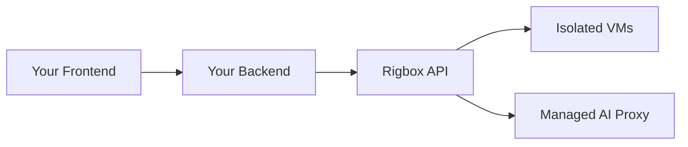

Rigbox provides the infrastructure primitives - isolated VMs, app routing, AI proxy, and credit management - so you can build a hosting platform on top without managing servers.

This guide walks through building a service like [Clawd](https://clawd.rigbox.dev) (an AI bot hosting platform) using the Rigbox REST API. By the end, you will have a working architecture for provisioning user workspaces, exposing apps, and managing AI credits.

<Note>
This is an integration guide for building your **own** backend on top of Rigbox, so the examples are in Python, JavaScript, and cURL rather than the `rig` CLI. Python is the default tab. If you just want to drive Rigbox from your terminal, use the [CLI](/cli-reference/cli) instead.
</Note>

---

## Architecture Overview

Your platform sits between your users and the Rigbox API:



Each user gets their own isolated micro-VM. Your backend orchestrates lifecycle, configuration, and monitoring through the Rigbox API. You handle user auth and billing; Rigbox handles VM isolation, networking, and AI proxy.

<Note>
  You handle user authentication and billing. Rigbox handles VM isolation, networking, and the AI proxy. This separation lets you focus on your product while Rigbox manages the infrastructure.
</Note>

---

## Setup

Every example uses the same base URL and bearer auth. Replace `YOUR_API_KEY` with an [API key](/cli-reference/authentication#api-keys). The later snippets assume these are already defined.

<CodeGroup>

```python Python
import requests

BASE = "https://api.rigbox.dev/api/v1"
headers = {"Authorization": "Bearer YOUR_API_KEY"}
```

```javascript JavaScript
const BASE = "https://api.rigbox.dev/api/v1";
const headers = {
  Authorization: "Bearer YOUR_API_KEY",
  "Content-Type": "application/json",
};
```

```bash cURL
export RIGBOX_API_KEY="YOUR_API_KEY"
export BASE="https://api.rigbox.dev/api/v1"
```

</CodeGroup>

---

## Step 1: Provision a Workspace

When a user signs up on your platform, provision a workspace for them using the quick-deploy endpoint. This creates a workspace from a template with sensible defaults.

<CodeGroup>

```python Python
resp = requests.post(f"{BASE}/quick-deploy", headers=headers, json={
    "name": "user-abc-workspace",
    "template_id": "dev",
})
workspace = resp.json()
# Store workspace["id"] in your database, linked to the user
print("Provisioned workspace:", workspace["id"])
```

```javascript JavaScript
const res = await fetch(`${BASE}/quick-deploy`, {
  method: "POST",
  headers,
  body: JSON.stringify({ name: "user-abc-workspace", template_id: "dev" }),
});
const workspace = await res.json();
// Store workspace.id in your database, linked to the user
console.log("Provisioned workspace:", workspace.id);
```

```bash cURL
curl -X POST "$BASE/quick-deploy" \
  -H "Authorization: Bearer $RIGBOX_API_KEY" \
  -H "Content-Type: application/json" \
  -d '{ "name": "user-abc-workspace", "template_id": "dev" }'
```

</CodeGroup>

Store the returned `workspace_id` in your database, linked to the user. This is how you will manage their workspace going forward.

The built-in templates are:

| Template | Use case |
|----------|----------|
| `base` | Minimal workspace, no extras |
| `dev` | Full development environment |
| `custom-repo` | Clone and run a git repository |

For app-specific stacks — bots, dashboards, scrapers — provision a `dev` workspace and install an [app recipe](/guides/catalog) (`@rigbox/<id>@builtin`) on top.

<Tip>
  Start with `quick-deploy` for the simplest provisioning flow. It creates the workspace, applies the template, and starts the VM in a single API call.
</Tip>

---

## Step 2: Configure AI

AI configuration is split: a workspace's **mode** (managed vs BYOK) is set per workspace at `/workspaces/{id}/mode`, while the default **provider and model** are account-level at `/users/me/ai-defaults`.

### Managed mode (recommended for getting started)

Rigbox injects the provider key and meters usage against the account's credit balance. Put the workspace in managed mode, then set the account default provider and model:

<CodeGroup>

```python Python
# Put the workspace in managed mode
requests.put(f"{BASE}/workspaces/{workspace_id}/mode",
             headers=headers, json={"mode": "managed"})

# Set the account default provider and model
requests.put(f"{BASE}/users/me/ai-defaults", headers=headers, json={
    "default_mode": "managed",
    "default_provider": "anthropic",
    "default_model": "claude-sonnet-4-20250514",
})
```

```javascript JavaScript
// Put the workspace in managed mode
await fetch(`${BASE}/workspaces/${workspaceId}/mode`, {
  method: "PUT",
  headers,
  body: JSON.stringify({ mode: "managed" }),
});

// Set the account default provider and model
await fetch(`${BASE}/users/me/ai-defaults`, {
  method: "PUT",
  headers,
  body: JSON.stringify({
    default_mode: "managed",
    default_provider: "anthropic",
    default_model: "claude-sonnet-4-20250514",
  }),
});
```

```bash cURL
# Put the workspace in managed mode
curl -X PUT "$BASE/workspaces/$WORKSPACE_ID/mode" \
  -H "Authorization: Bearer $RIGBOX_API_KEY" -H "Content-Type: application/json" \
  -d '{ "mode": "managed" }'

# Set the account default provider and model
curl -X PUT "$BASE/users/me/ai-defaults" \
  -H "Authorization: Bearer $RIGBOX_API_KEY" -H "Content-Type: application/json" \
  -d '{ "default_mode": "managed", "default_provider": "anthropic", "default_model": "claude-sonnet-4-20250514" }'
```

</CodeGroup>

### BYOK mode

Let users bring their own provider key. Put the workspace in BYOK mode, then supply the key as a workspace environment variable:

<CodeGroup>

```python Python
# Switch the workspace to BYOK
requests.put(f"{BASE}/workspaces/{workspace_id}/mode",
             headers=headers, json={"mode": "byok"})

# Provide the provider key as a workspace env var
requests.post(f"{BASE}/workspaces/{workspace_id}/env", headers=headers, json={
    "env_vars": {"ANTHROPIC_API_KEY": "sk-ant-..."},
})
```

```javascript JavaScript
// Switch the workspace to BYOK
await fetch(`${BASE}/workspaces/${workspaceId}/mode`, {
  method: "PUT",
  headers,
  body: JSON.stringify({ mode: "byok" }),
});

// Provide the provider key as a workspace env var
await fetch(`${BASE}/workspaces/${workspaceId}/env`, {
  method: "POST",
  headers,
  body: JSON.stringify({ env_vars: { ANTHROPIC_API_KEY: "sk-ant-..." } }),
});
```

```bash cURL
# Switch the workspace to BYOK
curl -X PUT "$BASE/workspaces/$WORKSPACE_ID/mode" \
  -H "Authorization: Bearer $RIGBOX_API_KEY" -H "Content-Type: application/json" \
  -d '{ "mode": "byok" }'

# Provide the provider key as a workspace env var
curl -X POST "$BASE/workspaces/$WORKSPACE_ID/env" \
  -H "Authorization: Bearer $RIGBOX_API_KEY" -H "Content-Type: application/json" \
  -d '{ "env_vars": { "ANTHROPIC_API_KEY": "sk-ant-..." } }'
```

</CodeGroup>

<Warning>
  Provider keys set on the workspace are stored in the control plane and injected into the VM at runtime. They are never exposed to other users.
</Warning>

Your UI can offer a settings page where users choose between managed and BYOK, and (for managed) select the account's preferred provider and model.

---

## Step 3: Expose the App

Once the workspace is running, you need to create app routes so your users' services are accessible from the internet.

### Reconcile template apps

If the workspace was created from a template, reconcile to create the default app routes. This reads the template's app definitions and creates a route for each one.

<CodeGroup>

```python Python
requests.post(f"{BASE}/workspaces/{workspace_id}/reconcile-apps", headers=headers)
```

```javascript JavaScript
await fetch(`${BASE}/workspaces/${workspaceId}/reconcile-apps`, {
  method: "POST",
  headers,
});
```

```bash cURL
curl -X POST "$BASE/workspaces/$WORKSPACE_ID/reconcile-apps" \
  -H "Authorization: Bearer $RIGBOX_API_KEY"
```

</CodeGroup>

### Create a custom app route

For custom services, create an app route manually:

<CodeGroup>

```python Python
resp = requests.post(f"{BASE}/apps", headers=headers, json={
    "workspace_id": "ws_abc123",
    "name": "user-api",
    "port": 3000,
})
app = resp.json()
# App is now live at https://{name}.rigbox.dev
print("App URL:", f"https://{app['name']}.rigbox.dev")
```

```javascript JavaScript
const app = await fetch(`${BASE}/apps`, {
  method: "POST",
  headers,
  body: JSON.stringify({
    workspace_id: "ws_abc123",
    name: "user-api",
    port: 3000,
  }),
}).then((r) => r.json());

// App is now live at https://{name}.rigbox.dev
console.log("App URL:", `https://${app.name}.rigbox.dev`);
```

```bash cURL
curl -X POST "$BASE/apps" \
  -H "Authorization: Bearer $RIGBOX_API_KEY" \
  -H "Content-Type: application/json" \
  -d '{ "workspace_id": "ws_abc123", "name": "user-api", "port": 3000 }'
```

</CodeGroup>

Each app gets a unique subdomain, prefixed with the workspace name: `{workspace}-{name}.rigbox.dev`, with automatic HTTPS.

---

## Step 4: Control Access

Set the visibility of each app based on your platform's requirements with `PUT /apps/{id}/visibility`.

### Make an app public

For user-facing apps that should be accessible by anyone:

<CodeGroup>

```python Python
requests.put(f"{BASE}/apps/{app_id}/visibility", headers=headers, json={
    "visibility": "public",
})
```

```javascript JavaScript
await fetch(`${BASE}/apps/${appId}/visibility`, {
  method: "PUT",
  headers,
  body: JSON.stringify({ visibility: "public" }),
});
```

```bash cURL
curl -X PUT "$BASE/apps/$APP_ID/visibility" \
  -H "Authorization: Bearer $RIGBOX_API_KEY" -H "Content-Type: application/json" \
  -d '{ "visibility": "public" }'
```

</CodeGroup>

### Restrict to specific users

For team or internal apps, use privileged mode with an allowlist:

<CodeGroup>

```python Python
requests.put(f"{BASE}/apps/{app_id}/visibility", headers=headers, json={
    "visibility": "privileged",
    "allowed_emails": ["alice@example.com", "bob@example.com"],
})
```

```javascript JavaScript
await fetch(`${BASE}/apps/${appId}/visibility`, {
  method: "PUT",
  headers,
  body: JSON.stringify({
    visibility: "privileged",
    allowed_emails: ["alice@example.com", "bob@example.com"],
  }),
});
```

```bash cURL
curl -X PUT "$BASE/apps/$APP_ID/visibility" \
  -H "Authorization: Bearer $RIGBOX_API_KEY" -H "Content-Type: application/json" \
  -d '{ "visibility": "privileged", "allowed_emails": ["alice@example.com", "bob@example.com"] }'
```

</CodeGroup>

| Visibility | Access |
|-----------|--------|
| `private` | Only the workspace owner |
| `privileged` | Owner + allowed emails |
| `public` | Anyone with the URL |

---

## Step 5: Monitor Health

Check app health before showing a "live" status indicator in your UI, and read workspace metrics for resource dashboards.

<CodeGroup>

```python Python
# App-level health check
health = requests.get(f"{BASE}/apps/{app_id}/health", headers=headers).json()

# Workspace-level metrics (CPU, memory, disk)
metrics = requests.get(f"{BASE}/workspaces/{workspace_id}/metrics", headers=headers).json()
```

```javascript JavaScript
// App-level health check
const health = await fetch(`${BASE}/apps/${appId}/health`, { headers }).then((r) => r.json());

// Workspace-level metrics (CPU, memory, disk)
const metrics = await fetch(`${BASE}/workspaces/${workspaceId}/metrics`, { headers }).then((r) => r.json());
```

```bash cURL
# App-level health check
curl "$BASE/apps/$APP_ID/health" -H "Authorization: Bearer $RIGBOX_API_KEY"

# Workspace-level metrics (CPU, memory, disk)
curl "$BASE/workspaces/$WORKSPACE_ID/metrics" -H "Authorization: Bearer $RIGBOX_API_KEY"
```

</CodeGroup>

The health endpoint returns a status you can map to a badge in your UI; the metrics endpoint returns CPU, memory, and disk usage for resource dashboards.

---

## Step 6: Show Credits and Usage

Three endpoints give you everything you need for a usage dashboard:

<CodeGroup>

```python Python
credits = requests.get(f"{BASE}/users/me/credits", headers=headers).json()
usage = requests.get(f"{BASE}/users/me/ai-usage", headers=headers).json()
limits = requests.get(f"{BASE}/users/me/limits", headers=headers).json()
```

```javascript JavaScript
const credits = await fetch(`${BASE}/users/me/credits`, { headers }).then((r) => r.json());
const usage = await fetch(`${BASE}/users/me/ai-usage`, { headers }).then((r) => r.json());
const limits = await fetch(`${BASE}/users/me/limits`, { headers }).then((r) => r.json());
```

```bash cURL
# Credit balance
curl "$BASE/users/me/credits" -H "Authorization: Bearer $RIGBOX_API_KEY"

# AI usage history
curl "$BASE/users/me/ai-usage" -H "Authorization: Bearer $RIGBOX_API_KEY"

# Plan limits (max workspaces, memory, monthly credits)
curl "$BASE/users/me/limits" -H "Authorization: Bearer $RIGBOX_API_KEY"
```

</CodeGroup>

---

## Step 7: Lifecycle Management

Let users start, stop, and delete their workspace instances through your UI.

<CodeGroup>

```python Python
# Start
requests.post(f"{BASE}/workspaces/{workspace_id}/start", headers=headers)

# Stop
requests.post(f"{BASE}/workspaces/{workspace_id}/stop", headers=headers)

# Delete (permanent)
requests.delete(f"{BASE}/workspaces/{workspace_id}", headers=headers)
```

```javascript JavaScript
// Start
await fetch(`${BASE}/workspaces/${workspaceId}/start`, { method: "POST", headers });

// Stop
await fetch(`${BASE}/workspaces/${workspaceId}/stop`, { method: "POST", headers });

// Delete (permanent)
await fetch(`${BASE}/workspaces/${workspaceId}`, { method: "DELETE", headers });
```

```bash cURL
# Start
curl -X POST "$BASE/workspaces/$WORKSPACE_ID/start" -H "Authorization: Bearer $RIGBOX_API_KEY"

# Stop
curl -X POST "$BASE/workspaces/$WORKSPACE_ID/stop" -H "Authorization: Bearer $RIGBOX_API_KEY"

# Delete (permanent)
curl -X DELETE "$BASE/workspaces/$WORKSPACE_ID" -H "Authorization: Bearer $RIGBOX_API_KEY"
```

</CodeGroup>

<Warning>
  Workspace deletion is permanent and cannot be undone. Show a confirmation dialog in your UI before calling this endpoint.
</Warning>

---

## Real-World Examples

### How Clawd does it

[Clawd](https://clawd.rigbox.dev) is an AI bot hosting platform built on Rigbox. Here is what makes it unique:

- **Bot runtime**: Runs the OpenClaw bot gateway (installed as an app recipe) for Telegram bot deployment
- **Billing**: Integrates Stripe for credit pack sales (billing is handled outside the Rigbox API)
- **Dashboard**: Shows real-time metrics and AI credit balance
- **AI config**: Lets users pick their provider and model through a settings UI

See the full API integration at [Clawd API Surface](/clawd-api-surface).

### How Sandbox does it

[Sandbox](https://sandbox.rigbox.dev) is a general-purpose coding environment built on Rigbox:

- **Template**: Uses `base` and `dev` templates for coding workspaces
- **Terminal**: Integrates terminal access via xterm.js WebSocket connections
- **Logs**: Streams app logs in real time via SSE (Server-Sent Events)
- **Apps**: Lets users create and manage multiple app routes per workspace

See the full API integration at [Sandbox API Surface](/sandbox-api-surface).

<Tip>
  Start by building the workspace provisioning flow with `quick-deploy`. Once that works, layer on app management, AI config, and monitoring incrementally.
</Tip>

---

## Next Steps

- [SSH Access](/guides/ssh-access) - Connect to workspaces over SSH
- [The Rigbox CLI](/cli-reference/cli) - Manage workspaces from the terminal
- [Workspaces API](/api-reference/workspaces/list) - Full workspace API reference
- [Apps API](/api-reference/apps/list) - Full apps API reference
- [AI & Credits API](/api-reference/ai/get-credits) - Credits, usage, and limits
