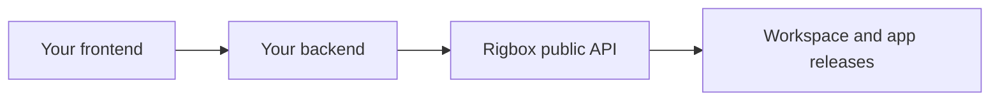

Build your product backend around explicit ownership and lifecycle state. Your browser talks to your backend; your backend holds Rigbox credentials and checks which end user can operate each workspace.

## Architecture Overview

Do not give every customer your account API key. Store a mapping between your own project/user IDs and Rigbox resource IDs.

## Setup

Start with the [API quickstart](/build/quickstart). Configure server-side credentials and error handling before adding mutations.

## Step 1: Provision a Workspace

Use [workspace lifecycle management](/build/workspace-lifecycle), persist its ID, and poll until it is ready. Select resources and a template supported by your account.

## Step 2: Configure AI

### Managed mode (recommended for getting started)

Follow [managed AI](/guides/managed-proxy). Distinguish account defaults from workspace configuration and per-subject metering.

### BYOK mode

Follow [bring your own keys](/guides/byok). Provider credentials deliberately supplied to an application must be treated as readable by that application.

## Step 3: Expose the App

### Reconcile template apps

[Template and catalog apps](/guides/catalog) have their own installation lifecycle. Verify their readiness instead of assuming they are available as soon as the VM runs.

### Create a custom app route

Use the [deployment lifecycle](/build/deploy-monitor) for managed app releases, or [port exposure](/guides/expose-and-route) for an already running service. Preserve the URL returned by the platform.

## Step 4: Control Access

### Make an app public

[Visibility](/guides/visibility) governs the app URL. Public means anyone with the URL can reach the route; your app may still need its own authentication.

### Restrict to specific users

Apply the supported private or email allowlist mode. Keep your own backend's authorization checks separate from URL visibility.

## Step 5: Monitor Health

Read [app health and logs](/build/deploy-monitor). Show preparation, activation, and runtime failures separately in your UI.

## Step 6: Show Credits and Usage

Use the account's reported usage and [managed-proxy accounting](/guides/managed-proxy). Missing cost metadata is not zero cost; do not promise an enforced spending limit unless the corresponding interface enforces it.

## Step 7: Lifecycle Management

Use [start, stop, and delete](/build/workspace-lifecycle) deliberately. Preserve data backups and explain destructive operations before exposing them to customers.

## Real-World Examples

### How Clawd does it

The [agent integration map](/clawd-api-surface) documents a first-party consumer and its API usage.

### How Sandbox does it

The [Sandbox integration map](/sandbox-api-surface) relates workspace and app operations to an interactive development UI.

## Next Steps

Implement one complete lifecycle in an isolated test workspace: provision, deploy, verify, update, roll back code, and clean up. Verify data recovery independently. Consult [security boundaries](/concepts/security) before exposing this workflow to untrusted users.
