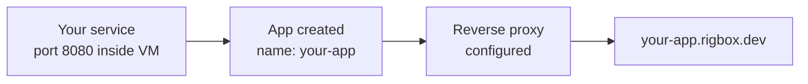

When a service runs inside your workspace, it's only accessible within the VM by default. To make it reachable from the internet, you create an **app** - a route that maps an internal port to a public URL at `{name}.rigbox.dev`.

## How Routing Works

The flow from a running service to a public URL:



Each app gets a unique subdomain on `rigbox.dev` of the form `<APP_NAME>.rigbox.dev`, where `<APP_NAME>` is the name you choose when creating the app. HTTPS is handled automatically - your service only needs to listen on HTTP inside the VM.

<Note>
App subdomains are globally unique across all Rigbox users. If a name is taken, you'll need to choose a different one.
</Note>

## Discover Listening Ports

Before exposing a port, you can check which ports have active listeners inside the workspace.

<CodeGroup>
```bash cURL
curl -s https://api.rigbox.dev/api/v1/workspaces/$WORKSPACE_ID/listening-ports \
  -H "Authorization: Bearer $RIGBOX_API_KEY" | jq
```

```python Python
import requests

response = requests.get(
    f"https://api.rigbox.dev/api/v1/workspaces/{workspace_id}/listening-ports",
    headers={"Authorization": f"Bearer {api_key}"},
)
for port_info in response.json():
    print(f"Port {port_info['port']} - {port_info.get('process', 'unknown')}")
```
</CodeGroup>

This scans the workspace for active TCP listeners and returns the port number along with the process name when available.

See [List Listening Ports](/api-reference/apps/listening-ports) for the full response schema.

## Create an App Manually

If you know the port and want full control over the app name, create it directly. Replace `<APP_NAME>` with a name of your choice — it will become the public subdomain.

```bash
rig app new <APP_NAME> --port 8080
```

From outside the workspace, add `--workspace <WORKSPACE_NAME>` to target a specific VM. Pass `--kind cli` for interactive tools you'll invoke over SSH rather than expose as a public service.

See [Create App](/api-reference/apps/create) for the API form.

## Expose Port Shortcut

The expose-port endpoint detects the process listening on the specified port and creates an app in one call. This is the easiest way to make a service public.

<CodeGroup>
```bash cURL
curl -X POST https://api.rigbox.dev/api/v1/workspaces/$WORKSPACE_ID/expose-port \
  -H "Authorization: Bearer $RIGBOX_API_KEY" \
  -H "Content-Type: application/json" \
  -d '{
    "port": 3000
  }'
```

```python Python
response = requests.post(
    f"https://api.rigbox.dev/api/v1/workspaces/{workspace_id}/expose-port",
    headers={"Authorization": f"Bearer {api_key}"},
    json={"port": 3000},
)
app = response.json()
print(f"Exposed at: https://{app['name']}.rigbox.dev")
```
</CodeGroup>

The endpoint automatically detects the process name and uses it to generate a sensible app name.

See [Expose Port](/api-reference/apps/expose-port) for details.

## Reconcile Template Apps

If your workspace was created from a template that defines default apps (like a web server or API), you can ensure those apps exist with a reconcile call.

```bash
curl -X POST https://api.rigbox.dev/api/v1/workspaces/$WORKSPACE_ID/reconcile-apps \
  -H "Authorization: Bearer $RIGBOX_API_KEY"
```

This checks the template definition and creates any missing apps. It's idempotent - running it multiple times has no side effects.

See [Reconcile Apps](/api-reference/apps/reconcile) for details.

## Check App Health

Before sharing a URL, verify the app is reachable.

<CodeGroup>
```bash cURL
curl -s https://api.rigbox.dev/api/v1/apps/$APP_ID/health \
  -H "Authorization: Bearer $RIGBOX_API_KEY" | jq
```

```python Python
response = requests.get(
    f"https://api.rigbox.dev/api/v1/apps/{app_id}/health",
    headers={"Authorization": f"Bearer {api_key}"},
)
health = response.json()
print(f"Healthy: {health['healthy']}")
```
</CodeGroup>

<Tip>
If health returns unhealthy, check that your service is actually listening on the correct port inside the VM. Use the listening-ports endpoint to verify.
</Tip>

See [App Health](/api-reference/apps/health-check) for the response schema.

## App Lifecycle: Start, Stop, Restart

Control the routing for an app without affecting the underlying service:

```bash
rig app stop <APP_NAME>
rig app start <APP_NAME>
rig app restart <APP_NAME>
```

| Action | Effect |
|--------|--------|
| `stop` | Removes the public route. The service inside the VM keeps running. |
| `start` | Re-enables the public route. |
| `restart` | Removes and re-adds the route. Useful if the proxy is in a bad state. |

See [Start App](/api-reference/apps/start), [Stop App](/api-reference/apps/stop), and [Restart App](/api-reference/apps/restart) for the API form.

## Update an App

You can rename an app or change its port. Renaming an app changes its public subdomain URL.

<CodeGroup>
```bash cURL
curl -X PATCH https://api.rigbox.dev/api/v1/apps/$APP_ID \
  -H "Authorization: Bearer $RIGBOX_API_KEY" \
  -H "Content-Type: application/json" \
  -d '{
    "name": "new-name"
  }'
```

```python Python
response = requests.patch(
    f"https://api.rigbox.dev/api/v1/apps/{app_id}",
    headers={"Authorization": f"Bearer {api_key}"},
    json={"name": "new-name"},
)
app = response.json()
print(f"New URL: https://{app['name']}.rigbox.dev")
```
</CodeGroup>

<Warning>
Renaming an app changes its public URL. Any existing links to the old subdomain will stop working immediately.
</Warning>

See [Update App](/api-reference/apps/update) for the full schema.

## Delete an App

Deleting an app removes the public route. The service inside the VM is unaffected.

```bash
rig app rm <APP_NAME>
```

See [Delete App](/api-reference/apps/delete) for the API form.

## Complete Example: Deploy a Python Server

This walkthrough starts a Python HTTP server inside a workspace and exposes it to the internet.

### Start a service inside the VM

SSH into your workspace and start a simple Python server:

```bash
# Inside the VM
python3 -m http.server 8080 &
```

### Expose the port

From inside the same workspace (or from your laptop with `--workspace <NAME>`):

```bash
rig app new my-server --port 8080
```

`rig app new` prints the resulting subdomain — `https://my-server.rigbox.dev`. If you'd rather have Rigbox detect the listening process and pick a name automatically, the [Expose Port](/api-reference/apps/expose-port) API endpoint does both in one shot.

### Verify health

```bash
curl -sf https://my-server.rigbox.dev/ -o /dev/null && echo "live" || echo "not ready yet"
```

For programmatic health checks via Rigbox's own probe, see [App Health](/api-reference/apps/health-check).

### Share the URL

Once healthy, anyone with the URL can access your service (if visibility is set to public). See [App Visibility](/guides/visibility) to control access.


## Next Steps

- [App Visibility](/guides/visibility) - control who can access your apps
- [Catalog Apps](/guides/catalog) - install VS Code, Jupyter, and more (routing is handled automatically)
- [Workspaces](/guides/workspaces) - workspace lifecycle management
