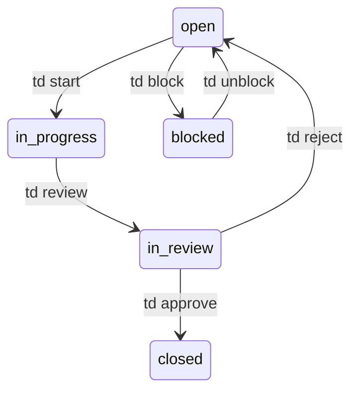

# Task Management with td

**td** is a task management CLI designed for AI-agent development workflows. It tracks issues locally in SQLite, enforces structured handoffs between sessions, and auto-syncs task state to the Rigbox platform. Rigbox ships a [fork](https://github.com/rigbox-dev/td) with workspace integration built in.

When an agent's context window ends, the next session picks up exactly where the last one left off - no lost context, no duplicated work.

<Note>
td is pre-installed in the `dev` image. For other images, install it via a [setup script](/guides/setup-scripts). See [Images & Templates](/guides/images-and-templates) for details.
</Note>

## Quick Start

Every AI agent session should start with:

```bash
td usage --new-session
```

This creates a new session, shows your current work, pending reviews, and the highest-priority tasks.

### Create and work on a task

```bash
# Create a task
td create "Add OAuth login flow" --type feature --priority P1

# Start working (records your session as implementer)
td start td-a1b2c3

# Log progress as you go
td log "OAuth callback endpoint working"
td log --decision "Using JWT for stateless sessions"

# Capture state before your context ends
td handoff td-a1b2c3 \
  --done "OAuth callback, token storage" \
  --remaining "Refresh token rotation, logout"

# Submit for review
td review td-a1b2c3
```

### Review from a different session

```bash
# See what's available to review
td reviewable

# Approve or reject
td approve td-a1b2c3 --reason "Tested in staging, looks good"
# or
td reject td-a1b2c3 --reason "Missing error handling in token refresh"
```

<Warning>
The session that implements a task cannot review it. This enforces code review by a different agent or human session. Minor tasks (`td add "fix typo" --minor`) are the exception - they allow self-review.
</Warning>

## Core Commands

### Task Management

| Command | What it does |
|---------|-------------|
| `td create "title" --type feature --priority P1` | Create a new task |
| `td add "title" --minor` | Create a self-reviewable minor task |
| `td list` | List all tasks |
| `td list --status in_progress` | Filter by status |
| `td show <id>` | View task details |
| `td update <id> --priority P0` | Update task fields |
| `td delete <id>` | Soft-delete a task |

### Workflow

| Command | What it does |
|---------|-------------|
| `td start <id>` | Begin work (open → in_progress) |
| `td log "message"` | Log progress on the focused task |
| `td log --decision "chose X because Y"` | Log a decision |
| `td log --blocker "stuck on X"` | Log a blocker |
| `td handoff <id>` | Capture done/remaining/decisions/uncertain |
| `td review <id>` | Submit for review (in_progress → in_review) |
| `td approve <id>` | Approve (different session only) |
| `td reject <id> --reason "..."` | Return for rework |

### Session & Context

| Command | What it does |
|---------|-------------|
| `td usage --new-session` | Start new session + show full context |
| `td usage -q` | Compact context (after first read) |
| `td current` | What am I working on? |
| `td next` | Highest-priority unblocked task |
| `td critical-path` | Optimal sequence to unblock the most work |
| `td reviewable` | Tasks you can review (not yours) |
| `td focus <id>` | Set working task |
| `td monitor` | Live TUI dashboard |

## Handoffs

Handoffs are the key mechanism for preserving context across sessions. They capture four categories of information:

```bash
td handoff td-a1b2c3 \
  --done "OAuth flow, token storage, login page" \
  --remaining "Refresh token rotation, logout endpoint" \
  --decision "Using JWT for stateless auth, 15min expiry" \
  --uncertain "Should tokens invalidate on password change?"
```

The next session runs `td usage --new-session` and sees exactly what was done, what's left, what was decided, and what's still uncertain.

<Tip>
Always handoff before your agent session ends. Run `td handoff <id>` even if you're mid-task - partial handoffs are better than no handoff.
</Tip>

## Multi-Issue Work Sessions

When tackling multiple related tasks, use work sessions to group them:

```bash
# Start a named work session
td ws start "Auth refactor"

# Tag related tasks (auto-starts open ones)
td ws tag td-a1b2c3 td-d4e5f6 td-g7h8i9

# Log progress (applies to all tagged tasks)
td ws log "Extracted shared token utils module"

# Handoff all tasks at once
td ws handoff
```

## Dependencies & Critical Path

Model task dependencies to understand what blocks what:

```bash
# Task A depends on Task B (B must be done first)
td dep add td-taskA td-taskB

# Find the optimal sequence to unblock the most work
td critical-path
```

`td critical-path` runs a topological sort weighted by how many downstream tasks each one unblocks. Work on the first item in the list to maximize throughput.

## Status Flow



Additional transitions:
- `td block <id>` / `td unblock <id>` - mark a task as blocked by a dependency
- `td close <id>` - admin closure (bypasses review, use sparingly)
- `td defer <id> 2026-04-15` - defer until a future date

## Platform Sync

When td runs inside a Rigbox workspace, it automatically syncs task state to the platform. No configuration needed - it detects the Rigbox environment and pushes after every mutating command.

**What gets synced**: task ID, title, status, priority, type, implementer session, timestamps.

**Where it appears**:
- The [Sidecar](/guides/sidecar-dashboard) Rigbox plugin shows task counts and sync status
- The workspace tasks API: [GET /workspaces/{id}/tasks](/api-reference/workspaces/tasks)

**Sync status** is written to `.todos/.rigbox-sync` - you can check it with:

```bash
cat .todos/.rigbox-sync
# {"last_sync": "2026-04-07T12:34:56Z", "status": "ok", "synced": 42}
```

<Note>
Sync is debounced (500ms) and non-blocking. If the API is unreachable, td continues working locally and retries on the next command.
</Note>

## Monitoring

Run `td monitor` for a live TUI dashboard inside your terminal:

```bash
td monitor
```

Keyboard shortcuts:
- `b` - toggle board view (swimlanes)
- `/` - search tasks
- `s` - show statistics
- `c` - toggle showing closed tasks
- `q` - quit

## Query Language

td includes a query language (TDQ) for filtering tasks:

```bash
# Find high-priority in-progress features
td query "status = in_progress AND priority <= P1 AND type = feature"

# Find stale tasks (not updated in 14 days)
td query "stale(14)"

# Find rejected tasks needing rework
td query "rework()"
```

## Example: AI Agent Workflow

Here's a typical workflow for an AI coding agent working inside a Rigbox workspace:

```bash
# 1. Agent starts a new session
td usage --new-session

# 2. Check what to work on
td next
# → td-a1b2c3 "Add user settings page" P1 feature

# 3. Start work
td start td-a1b2c3

# 4. Work and log progress
td log "Created settings page component"
td log "Added API integration for GET/PUT /users/me/settings"
td log --decision "Using form validation library zod"

# 5. Handoff before context ends
td handoff td-a1b2c3 \
  --done "Settings page UI, API integration, form validation" \
  --remaining "Add theme preference toggle, test error states"

# 6. Submit for review
td review td-a1b2c3

# 7. Different agent session reviews
td usage --new-session
td reviewable
td approve td-a1b2c3 --reason "UI matches design spec, API calls correct"
```

## Credits

td was originally created by [Marcus Vorwaller](https://github.com/marcus/td) and is distributed under the MIT License. Rigbox maintains a [fork](https://github.com/rigbox-dev/td) with added workspace detection and platform sync.

## Next Steps

- [Sidecar Dashboard](/guides/sidecar-dashboard) - TUI that integrates td with git, files, and Rigbox metrics
- [Setup Scripts](/guides/setup-scripts) - install td in non-dev images automatically
- [Workspace Tasks API](/api-reference/workspaces/tasks) - read synced tasks programmatically
