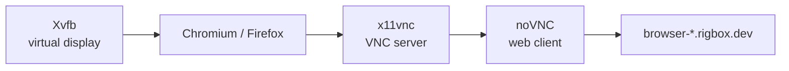

Virtual Browser lets you run a full Chromium or Firefox browser inside your workspace and control it remotely from your own browser. It uses a headless display server with VNC streaming - you see and interact with the remote browser as if it were running locally.

## Use Cases

- **Web scraping** - browse sites from a VM IP address, avoiding bot detection on your local machine
- **UI testing** - visually verify web applications running inside the workspace
- **Web tool access** - use browser-based tools (admin panels, dashboards) from within the VM network
- **Screenshot automation** - capture pages rendered by a real browser engine
- **Multi-browser testing** - both Chromium and Firefox are available for cross-browser verification

## How It Works

Virtual Browser runs three components inside your workspace:



You open the noVNC URL in your own browser and get a live, interactive view of the remote browser.

## Requirements

Virtual Browser requires **Xvfb** and **x11vnc** to be installed in the workspace. These are pre-installed in the `full` image along with Chromium and Firefox via Playwright.

| Image | Status | What's included |
|-------|--------|-----------------|
| `full` | Ready to launch | Xvfb, x11vnc, Chromium, Firefox, Playwright |
| `base` | Requires installation | None of the above |
| `dev` | Requires installation | None of the above |
| `openclaw` | Requires installation | None of the above |

<Tip>
The `full` image has browsers pre-installed, so launching is nearly instant. On other images, installation downloads Chromium and Firefox which can take several minutes.
</Tip>

## Installation

If your workspace doesn't use the `full` image, install Virtual Browser first. This installs Playwright along with Chromium and Firefox browsers.

<CodeGroup>
```bash cURL
curl -X POST https://api.rigbox.dev/api/workspaces/$WORKSPACE_ID/tools/virtual-browser/install \
  -H "Authorization: Bearer $RIGBOX_API_KEY"
```

```python Python
import requests

response = requests.post(
    f"https://api.rigbox.dev/api/workspaces/{workspace_id}/tools/virtual-browser/install",
    headers={"Authorization": f"Bearer {api_key}"},
)
print(f"Installation started: {response.json()}")
```
</CodeGroup>

<Note>
Installation downloads browser binaries and their dependencies. This can take 3-5 minutes on a `base` image workspace depending on network speed.
</Note>

See [Install Tool](/api-reference/tools/install) for the full response schema.

### Tracking Installation Progress

Poll the installation status to know when the browser is ready.

<CodeGroup>
```bash cURL
while true; do
  STATUS=$(curl -s https://api.rigbox.dev/api/workspaces/$WORKSPACE_ID/tools/virtual-browser/install-status \
    -H "Authorization: Bearer $RIGBOX_API_KEY" | jq -r '.status')
  echo "Status: $STATUS"
  [ "$STATUS" = "installed" ] && break
  sleep 5
done
```

```python Python
import time

while True:
    resp = requests.get(
        f"https://api.rigbox.dev/api/workspaces/{workspace_id}/tools/virtual-browser/install-status",
        headers={"Authorization": f"Bearer {api_key}"},
    )
    status = resp.json()["status"]
    print(f"Installation: {status}")
    if status == "installed":
        break
    time.sleep(5)
```
</CodeGroup>

See [Installation Status](/api-reference/tools/install-status) for the response schema.

## Launching Virtual Browser

Once installed (or immediately on the `full` image), launch the browser.

<CodeGroup>
```bash cURL
curl -X POST https://api.rigbox.dev/api/workspaces/$WORKSPACE_ID/tools/virtual-browser/launch \
  -H "Authorization: Bearer $RIGBOX_API_KEY"
```

```python Python
response = requests.post(
    f"https://api.rigbox.dev/api/workspaces/{workspace_id}/tools/virtual-browser/launch",
    headers={"Authorization": f"Bearer {api_key}"},
)
print(f"Virtual Browser launched")
```
</CodeGroup>

See [Launch Tool](/api-reference/tools/launch) for the response schema.

## Accessing the Browser

Once launched, Virtual Browser is accessible via noVNC on **port 8892** inside the workspace. The public URL is:

```
https://browser-{workspace-id}.rigbox.dev
```

Open this URL in your local browser. You'll see the remote browser's display and can interact with it using your mouse and keyboard.

<Note>
The `browser-` prefixed subdomain is created automatically when you launch Virtual Browser. You don't need to create an app route manually.
</Note>

### Interacting with the Remote Browser

Once connected via noVNC:

- **Click** anywhere to interact with page elements
- **Type** to enter text in input fields and the address bar
- **Scroll** with your mouse wheel or trackpad
- **Navigate** using the browser's address bar, back/forward buttons
- **Open new tabs** using keyboard shortcuts (Ctrl+T) or right-click menus

<Tip>
The noVNC client supports clipboard sharing. Copy text on your local machine and paste it into the remote browser, or vice versa. Use the noVNC sidebar menu for clipboard controls.
</Tip>

## Stopping Virtual Browser

Stop the browser when you're done to free up resources.

<CodeGroup>
```bash cURL
curl -X POST https://api.rigbox.dev/api/workspaces/$WORKSPACE_ID/tools/virtual-browser/stop \
  -H "Authorization: Bearer $RIGBOX_API_KEY"
```

```python Python
requests.post(
    f"https://api.rigbox.dev/api/workspaces/{workspace_id}/tools/virtual-browser/stop",
    headers={"Authorization": f"Bearer {api_key}"},
)
print("Virtual Browser stopped")
```
</CodeGroup>

See [Stop Tool](/api-reference/tools/stop) for details.

## Complete Example: Browse a Local Web App

This walkthrough starts a web app inside the workspace and uses Virtual Browser to view it.

### Create a workspace with the full image

```python
import requests
import time

API_URL = "https://api.rigbox.dev/api"
HEADERS = {"Authorization": f"Bearer {api_key}"}

# Quick deploy with the full template
workspace = requests.post(
    f"{API_URL}/quick-deploy",
    headers=HEADERS,
    json={"template_id": "full"},
).json()

workspace_id = workspace["id"]

# Wait for the workspace to be running
while True:
    status = requests.get(
        f"{API_URL}/workspaces/{workspace_id}",
        headers=HEADERS,
    ).json()["status"]
    if status == "running":
        break
    time.sleep(2)

print(f"Workspace running: {workspace_id}")
```

### Start a local web app

SSH into the workspace and start your web application:

```bash
# Inside the VM
cd /home/developer/my-app
npm run dev -- --port 3000 &
```

### Launch Virtual Browser

```python
response = requests.post(
    f"{API_URL}/workspaces/{workspace_id}/tools/virtual-browser/launch",
    headers=HEADERS,
)
browser_url = f"https://browser-{workspace_id}.rigbox.dev"
print(f"Open in your browser: {browser_url}")
```

### View your app in the remote browser

Open the noVNC URL in your local browser. In the remote Chromium browser, navigate to `http://localhost:3000` to see your web app rendered by a real browser engine inside the VM.

### Stop when done

```python
requests.post(
    f"{API_URL}/workspaces/{workspace_id}/tools/virtual-browser/stop",
    headers=HEADERS,
)
```


## Programmatic Browser Control with Playwright

Since Virtual Browser installs Playwright, you can also control the browser programmatically from within the VM for automation tasks.

```python
# Inside the VM - run this as a Python script
from playwright.sync_api import sync_playwright

with sync_playwright() as p:
    browser = p.chromium.launch()
    page = browser.new_page()
    page.goto("https://example.com")
    page.screenshot(path="screenshot.png")
    print(f"Title: {page.title()}")
    browser.close()
```

This is useful for:
- Automated screenshot capture
- Web scraping with full JavaScript rendering
- End-to-end testing of web applications
- PDF generation from web pages

<Warning>
Virtual Browser (the VNC-based UI) and Playwright scripts use separate browser instances. Launching Virtual Browser does not affect Playwright scripts, and vice versa.
</Warning>

## Next Steps

- [Architecture Explorer](/guides/architecture-explorer) - visualize code structure and dependencies
- [Images & Templates](/guides/images-and-templates) - choose the `full` image for pre-installed tools
- [Catalog Apps](/guides/catalog) - install VS Code, Jupyter, and other pre-packaged apps
