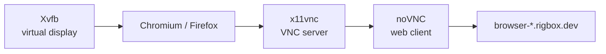

Virtual Browser lets you run a full Chromium or Firefox browser inside your workspace and control it remotely from your own browser. It uses a headless display server with VNC streaming - you see and interact with the remote browser as if it were running locally.

## Use Cases

- **Web scraping** - browse sites from a VM IP address, avoiding bot detection on your local machine
- **UI testing** - visually verify web applications running inside the workspace
- **Web tool access** - use browser-based tools (admin panels, dashboards) from within the VM network
- **Screenshot automation** - capture pages rendered by a real browser engine
- **Multi-browser testing** - both Chromium and Firefox are available for cross-browser verification

## How It Works

Virtual Browser runs three components inside your workspace:


```mermaid
flowchart LR
    A[Xvfb\nvirtual display] --> B[Chromium / Firefox]
    B --> C[x11vnc\nVNC server]
    C --> D[noVNC\nweb client]
    D --> E[browser-*.rigbox.dev]
```

You open the noVNC URL in your own browser and get a live, interactive view of the remote browser.

## Requirements

Virtual Browser requires **Xvfb** and **x11vnc** to be installed in the workspace, along with Chromium and Firefox via Playwright. None of these come pre-installed, so you install them as part of the tool.

| Image | Status | What's included |
|-------|--------|-----------------|
| `base` | Requires installation | None of the above |
| `dev` | Requires installation | None of the above |

<Tip>
Installation downloads Chromium and Firefox, which can take several minutes on either image.
</Tip>

## Installation

Install Virtual Browser before launching it. This installs Playwright along with Chromium and Firefox browsers. The install runs asynchronously and prints a job id you can poll.

```bash
rig tools install --workspace $WORKSPACE --tool virtual-browser
```

<Note>
Installation downloads browser binaries and their dependencies. This can take 3-5 minutes on a `base` image workspace depending on network speed.
</Note>

See [Install Tool](/api-reference/tools/install) for the full response schema.

### Tracking Installation Progress

Poll the installation status with the job id from `rig tools install` to know when the browser is ready.

```bash
rig tools install-status --workspace $WORKSPACE --tool virtual-browser --job-id $JOB_ID
```

See [Installation Status](/api-reference/tools/install-status) for the response schema.

## Launching Virtual Browser

Once installed, launch the browser.

```bash
rig tools launch --workspace $WORKSPACE --tool virtual-browser
```

See [Launch Tool](/api-reference/tools/launch) for the response schema.

## Accessing the Browser

Once launched, Virtual Browser is accessible via noVNC on **port 8892** inside the workspace. The public URL is:

```
https://browser-{workspace-id}.rigbox.dev
```

Open this URL in your local browser. You'll see the remote browser's display and can interact with it using your mouse and keyboard.

<Note>
The `browser-` prefixed subdomain is created automatically when you launch Virtual Browser. You don't need to create an app route manually.
</Note>

### Interacting with the Remote Browser

Once connected via noVNC:

- **Click** anywhere to interact with page elements
- **Type** to enter text in input fields and the address bar
- **Scroll** with your mouse wheel or trackpad
- **Navigate** using the browser's address bar, back/forward buttons
- **Open new tabs** using keyboard shortcuts (Ctrl+T) or right-click menus

<Tip>
The noVNC client supports clipboard sharing. Copy text on your local machine and paste it into the remote browser, or vice versa. Use the noVNC sidebar menu for clipboard controls.
</Tip>

## Stopping Virtual Browser

Stop the browser when you're done to free up resources.

```bash
rig tools stop --workspace $WORKSPACE --tool virtual-browser
```

See [Stop Tool](/api-reference/tools/stop) for details.

## Complete Example: Browse a Local Web App

This walkthrough starts a web app inside the workspace and uses Virtual Browser to view it.

### Create a workspace with the dev image

`rig workspace spawn` creates the workspace from the `dev` template, boots it, and waits until it's ready:

```bash
rig workspace spawn --name browser-demo --template dev
```

### Start a local web app

SSH into the workspace and start your web application. Replace `<APP_DIR>` with the path to your project (for example, `/home/developer/my-app`):

```bash
# Inside the VM
cd <APP_DIR>
npm run dev -- --port 3000 &
```

### Launch Virtual Browser

```bash
rig tools launch --workspace browser-demo --tool virtual-browser
```

Then open `https://browser-<workspace-id>.rigbox.dev` in your local browser.

### View your app in the remote browser

Open the noVNC URL in your local browser. In the remote Chromium browser, navigate to `http://localhost:3000` to see your web app rendered by a real browser engine inside the VM.

### Stop when done

```bash
rig tools stop --workspace browser-demo --tool virtual-browser
```


## Programmatic Browser Control with Playwright

Since Virtual Browser installs Playwright, you can also control the browser programmatically from within the VM for automation tasks.

```python
# Inside the VM - run this as a Python script
from playwright.sync_api import sync_playwright

with sync_playwright() as p:
    browser = p.chromium.launch()
    page = browser.new_page()
    page.goto("https://example.com")
    page.screenshot(path="screenshot.png")
    print(f"Title: {page.title()}")
    browser.close()
```

This is useful for:
- Automated screenshot capture
- Web scraping with full JavaScript rendering
- End-to-end testing of web applications
- PDF generation from web pages

<Warning>
Virtual Browser (the VNC-based UI) and Playwright scripts use separate browser instances. Launching Virtual Browser does not affect Playwright scripts, and vice versa.
</Warning>

## Next Steps

- [Architecture Explorer](/guides/architecture-explorer) - visualize code structure and dependencies
- [Images & Templates](/guides/images-and-templates) - choose the `dev` image for a richer development environment
- [Catalog Apps](/guides/catalog) - install VS Code, Jupyter, and other pre-packaged apps
