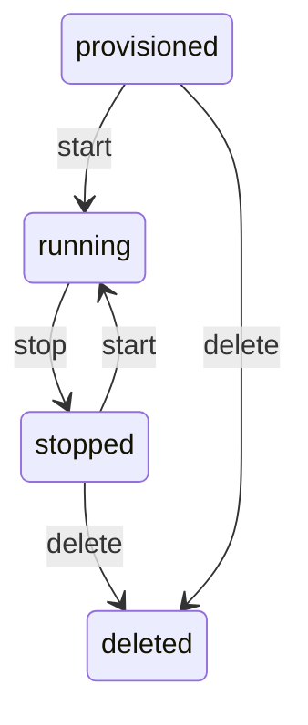

A **workspace** is an isolated micro-VM running full Debian 12 Linux with systemd, SSH access, and its own private IP address. Each workspace gets dedicated CPU, RAM, and disk - nothing is shared with other workspaces.

Workspaces are the core primitive in Rigbox. You create one, run code inside it, expose services to the internet, and tear it down when you're done.

## Workspace Lifecycle

Every workspace moves through a predictable set of states:

<div style={{textAlign: 'center'}}>



</div>

| Status | Description |
|--------|-------------|
| `provisioned` | VM is allocated but not yet booted |
| `running` | VM is booted and accepting connections |
| `stopped` | VM is shut down; disk state is preserved |
| `deleted` | VM and all data are permanently removed |

<Note>
A stopped workspace retains its disk contents. You can restart it at any time without losing files or installed packages.
</Note>

## Creating a Workspace

To create a workspace, send a POST request with the VM configuration.

<CodeGroup>
```bash cURL
curl -X POST https://api.rigbox.dev/api/v1/workspaces \
  -H "Authorization: Bearer $RIGBOX_API_KEY" \
  -H "Content-Type: application/json" \
  -d '{
    "name": "my-project",
    "image": "base",
    "ram_mb": 512,
    "disk_size_mb": 3072,
    "vcpu_count": 1
  }'
```

```python Python
import requests

response = requests.post(
    "https://api.rigbox.dev/api/v1/workspaces",
    headers={"Authorization": f"Bearer {api_key}"},
    json={
        "name": "my-project",
        "image": "base",
        "ram_mb": 512,
        "disk_size_mb": 3072,
        "vcpu_count": 1,
    },
)
workspace = response.json()
print(f"Workspace ID: {workspace['id']}")
```
</CodeGroup>

The response includes the workspace `id` you'll use for all subsequent operations.

See [Create Workspace](/api-reference/workspaces/create) for the full request/response schema.

## Quick Deploy with a Template

If you don't need custom sizing, use quick deploy to create a workspace from a pre-configured template in a single call.

<CodeGroup>
```bash cURL
curl -X POST https://api.rigbox.dev/api/v1/quick-deploy \
  -H "Authorization: Bearer $RIGBOX_API_KEY" \
  -H "Content-Type: application/json" \
  -d '{
    "template_id": "dev"
  }'
```

```python Python
response = requests.post(
    "https://api.rigbox.dev/api/v1/quick-deploy",
    headers={"Authorization": f"Bearer {api_key}"},
    json={"template_id": "dev"},
)
workspace = response.json()
```
</CodeGroup>

Quick deploy selects the image, RAM, disk, and vCPU settings from the template. See [Images & Templates](/guides/images-and-templates) for available templates.

## Starting a Workspace

After creation, boot the workspace with a start request, then poll until the status is `running`.

### Send the start request

<CodeGroup>
```bash cURL
curl -X POST https://api.rigbox.dev/api/v1/workspaces/$WORKSPACE_ID/start \
  -H "Authorization: Bearer $RIGBOX_API_KEY"
```

```python Python
requests.post(
    f"https://api.rigbox.dev/api/v1/workspaces/{workspace_id}/start",
    headers={"Authorization": f"Bearer {api_key}"},
)
```
</CodeGroup>

### Poll until running

The VM takes a few seconds to boot. Poll the workspace endpoint until `status` is `running`.

<CodeGroup>
```bash cURL
while true; do
  STATUS=$(curl -s https://api.rigbox.dev/api/v1/workspaces/$WORKSPACE_ID \
    -H "Authorization: Bearer $RIGBOX_API_KEY" | jq -r '.status')
  echo "Status: $STATUS"
  [ "$STATUS" = "running" ] && break
  sleep 2
done
```

```python Python
import time

while True:
    resp = requests.get(
        f"https://api.rigbox.dev/api/v1/workspaces/{workspace_id}",
        headers={"Authorization": f"Bearer {api_key}"},
    )
    status = resp.json()["status"]
    print(f"Status: {status}")
    if status == "running":
        break
    time.sleep(2)
```
</CodeGroup>

### Workspace is ready

Once `running`, you can SSH in, expose ports, install catalog apps, and more.


See [Start Workspace](/api-reference/workspaces/start) for response details.

## Stopping a Workspace

Stopping a workspace shuts down the VM but preserves the disk. You can restart it later.

<CodeGroup>
```bash cURL
curl -X POST https://api.rigbox.dev/api/v1/workspaces/$WORKSPACE_ID/stop \
  -H "Authorization: Bearer $RIGBOX_API_KEY"
```

```python Python
requests.post(
    f"https://api.rigbox.dev/api/v1/workspaces/{workspace_id}/stop",
    headers={"Authorization": f"Bearer {api_key}"},
)
```
</CodeGroup>

<Tip>
Stop workspaces you aren't actively using. Stopped workspaces don't consume CPU or RAM resources.
</Tip>

See [Stop Workspace](/api-reference/workspaces/stop) for details.

## Resizing a Workspace

You can change the RAM, vCPU count, and disk size of a workspace. The workspace must be stopped first.

<CodeGroup>
```bash cURL
curl -X PUT https://api.rigbox.dev/api/v1/workspaces/$WORKSPACE_ID/resources \
  -H "Authorization: Bearer $RIGBOX_API_KEY" \
  -H "Content-Type: application/json" \
  -d '{
    "ram_mb": 1024,
    "vcpu_count": 2,
    "disk_size_mb": 5120
  }'
```

```python Python
requests.put(
    f"https://api.rigbox.dev/api/v1/workspaces/{workspace_id}/resources",
    headers={"Authorization": f"Bearer {api_key}"},
    json={
        "ram_mb": 1024,
        "vcpu_count": 2,
        "disk_size_mb": 5120,
    },
)
```
</CodeGroup>

<Warning>
The workspace must be in a `stopped` state before resizing. Start it again after the resize completes.
</Warning>

See [Update Workspace Resources](/api-reference/workspaces/update-resources) for the full schema.

## Environment Variables

Set environment variables that are injected into the workspace on boot.

<CodeGroup>
```bash cURL
curl -X POST https://api.rigbox.dev/api/v1/workspaces/$WORKSPACE_ID/env \
  -H "Authorization: Bearer $RIGBOX_API_KEY" \
  -H "Content-Type: application/json" \
  -d '{
    "env_vars": {
      "DATABASE_URL": "postgres://localhost:5432/mydb",
      "API_SECRET": "sk-abc123"
    }
  }'
```

```python Python
requests.post(
    f"https://api.rigbox.dev/api/v1/workspaces/{workspace_id}/env",
    headers={"Authorization": f"Bearer {api_key}"},
    json={
        "env_vars": {
            "DATABASE_URL": "postgres://localhost:5432/mydb",
            "API_SECRET": "sk-abc123",
        }
    },
)
```
</CodeGroup>

<Tip>
Environment variables persist across restarts. You don't need to set them again after stopping and starting a workspace.
</Tip>

See [Update Workspace Environment](/api-reference/workspaces/update-env) for details.

## Live Metrics

Monitor CPU, RAM, and disk usage in real time.

<CodeGroup>
```bash cURL
curl -s https://api.rigbox.dev/api/v1/workspaces/$WORKSPACE_ID/metrics \
  -H "Authorization: Bearer $RIGBOX_API_KEY" | jq
```

```python Python
response = requests.get(
    f"https://api.rigbox.dev/api/v1/workspaces/{workspace_id}/metrics",
    headers={"Authorization": f"Bearer {api_key}"},
)
metrics = response.json()
print(f"CPU: {metrics['cpu_percent']}%")
print(f"RAM: {metrics['ram_used_mb']} / {metrics['ram_total_mb']} MB")
print(f"Disk: {metrics['disk_used_mb']} / {metrics['disk_total_mb']} MB")
```
</CodeGroup>

See [Get Metrics](/api-reference/workspaces/get-metrics) for the full response schema.

## Logs

Retrieve workspace logs or stream them in real time via Server-Sent Events.

<CodeGroup>
```bash cURL (recent logs)
curl -s https://api.rigbox.dev/api/v1/workspaces/$WORKSPACE_ID/logs \
  -H "Authorization: Bearer $RIGBOX_API_KEY"
```

```bash cURL (live stream)
curl -N https://api.rigbox.dev/api/v1/workspaces/$WORKSPACE_ID/logs/stream \
  -H "Authorization: Bearer $RIGBOX_API_KEY"
```

```python Python (recent logs)
response = requests.get(
    f"https://api.rigbox.dev/api/v1/workspaces/{workspace_id}/logs",
    headers={"Authorization": f"Bearer {api_key}"},
)
for line in response.json()["logs"]:
    print(line)
```
</CodeGroup>

The `/logs/stream` endpoint returns Server-Sent Events (SSE). Use an SSE client library for production integrations.

See [Get Logs](/api-reference/workspaces/get-logs) and [Stream Logs](/api-reference/workspaces/stream-logs) for details.

## Deleting a Workspace

<Warning>
Deleting a workspace is **irreversible**. All files, installed packages, and configuration inside the VM are permanently destroyed. Make sure you've saved anything important before deleting.
</Warning>

<CodeGroup>
```bash cURL
curl -X DELETE https://api.rigbox.dev/api/v1/workspaces/$WORKSPACE_ID \
  -H "Authorization: Bearer $RIGBOX_API_KEY"
```

```python Python
requests.delete(
    f"https://api.rigbox.dev/api/v1/workspaces/{workspace_id}",
    headers={"Authorization": f"Bearer {api_key}"},
)
```
</CodeGroup>

See [Delete Workspace](/api-reference/workspaces/delete) for details.

## Complete Example: Create, Start, and Poll

This end-to-end example creates a workspace, starts it, and waits for it to be ready.

```python Python
import requests
import time

API_URL = "https://api.rigbox.dev/api/v1"
HEADERS = {"Authorization": f"Bearer {api_key}"}

# 1. Create the workspace
workspace = requests.post(
    f"{API_URL}/workspaces",
    headers=HEADERS,
    json={
        "name": "demo-workspace",
        "image": "base",
        "ram_mb": 512,
        "disk_size_mb": 3072,
        "vcpu_count": 1,
    },
).json()

workspace_id = workspace["id"]
print(f"Created workspace: {workspace_id}")

# 2. Start the workspace
requests.post(f"{API_URL}/workspaces/{workspace_id}/start", headers=HEADERS)

# 3. Poll until running
while True:
    resp = requests.get(f"{API_URL}/workspaces/{workspace_id}", headers=HEADERS)
    status = resp.json()["status"]
    print(f"  Status: {status}")
    if status == "running":
        break
    time.sleep(2)

print(f"Workspace {workspace_id} is running and ready to use.")
```

## Next Steps

- [Images & Templates](/guides/images-and-templates) - choose the right base image
- [Expose Ports & Route Apps](/guides/expose-and-route) - make services accessible at `*.rigbox.dev`
- [Catalog Apps](/guides/catalog) - install VS Code, Jupyter, and more in one call
