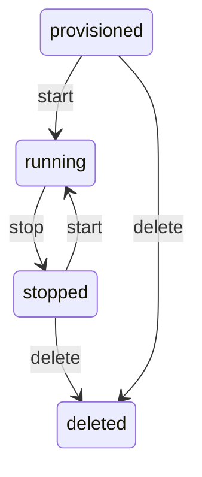

A **workspace** is an isolated micro-VM running full Debian 12 Linux with systemd, SSH access, and its own private IP address. Each workspace gets dedicated CPU, RAM, and disk - nothing is shared with other workspaces.

Workspaces are the core primitive in Rigbox. You create one, run code inside it, expose services to the internet, and tear it down when you're done.

## Workspace Lifecycle

Every workspace moves through a predictable set of states:

<div style={{textAlign: 'center'}}>



</div>

| Status | Description |
|--------|-------------|
| `provisioned` | VM is allocated but not yet booted |
| `running` | VM is booted and accepting connections |
| `stopped` | VM is shut down; disk state is preserved |
| `deleted` | VM and all data are permanently removed |

<Note>
A stopped workspace retains its disk contents. You can restart it at any time without losing files or installed packages.
</Note>

## Creating a Workspace

Use the [Rigbox CLI](/guides/cli) to create a workspace. Replace `<WORKSPACE_NAME>` with a name of your choice (for example, `my-project`):

```bash
rig workspace new --name <WORKSPACE_NAME> --template base --ram 512 --vcpu 1 --disk 3072
```

The flags are optional - leave them off to use the `base` template. If requested resources are below the template or catalog floor, Rigbox raises them before creating the workspace. `rig workspace new` prints the new workspace's ID, status, and connection info on stdout.

For the underlying HTTP shape, see [Create Workspace](/api-reference/workspaces/create) in the API reference.

## Quick Deploy with a Template

If you don't need custom sizing, deploy from a pre-configured template in one command:

```bash
rig workspace spawn --name <WORKSPACE_NAME> --template dev
```

`rig workspace spawn` creates the workspace, starts it, and waits until it's ready - all in one call. See [Images & Templates](/guides/images-and-templates) for the list of templates, or [Quick Deploy](/api-reference/templates/quick-deploy) for the API.

## Starting a Workspace

Boot a previously-stopped workspace and wait for it to become `running`:

```bash
rig workspace start --name <WORKSPACE_NAME_OR_ID>
```

`rig workspace start` polls the workspace status internally and returns once the VM is up. If a stopped workspace is below its template or catalog resource floor, Rigbox raises the stored resources before booting. Add `--wait-for-apps` to wait for workspace apps to report active before the command returns. For scripting, `rig workspace ls` prints the current state. See [Start Workspace](/api-reference/workspaces/start) for the API form.

### Workspace is ready

Once `running`, you can SSH in, expose ports, install catalog apps, and more.

## Stopping a Workspace

Stopping a workspace shuts down the VM but preserves the disk. You can restart it later.

```bash
rig workspace stop --name <WORKSPACE_NAME_OR_ID>
```

<Tip>
Stop workspaces you aren't actively using. Stopped workspaces don't consume CPU or RAM resources.
</Tip>

See [Stop Workspace](/api-reference/workspaces/stop) for the API form.

## Resizing a Workspace

You can change the RAM, vCPU count, and disk size of a workspace. The workspace must be stopped first.

<CodeGroup>
```bash cURL
curl -X PUT https://api.rigbox.dev/api/v1/workspaces/$WORKSPACE_ID/resources \
  -H "Authorization: Bearer $RIGBOX_API_KEY" \
  -H "Content-Type: application/json" \
  -d '{
    "ram_mb": 1024,
    "vcpu_count": 2,
    "disk_size_mb": 5120
  }'
```

```python Python
requests.put(
    f"https://api.rigbox.dev/api/v1/workspaces/{workspace_id}/resources",
    headers={"Authorization": f"Bearer {api_key}"},
    json={
        "ram_mb": 1024,
        "vcpu_count": 2,
        "disk_size_mb": 5120,
    },
)
```
</CodeGroup>

<Warning>
The workspace must be in a `stopped` state before resizing. Start it again after the resize completes.
</Warning>

See [Update Workspace Resources](/api-reference/workspaces/update-resources) for the full schema.

## Environment Variables

Set environment variables that are injected into the workspace on boot.

<CodeGroup>
```bash cURL
curl -X POST https://api.rigbox.dev/api/v1/workspaces/$WORKSPACE_ID/env \
  -H "Authorization: Bearer $RIGBOX_API_KEY" \
  -H "Content-Type: application/json" \
  -d '{
    "env_vars": {
      "DATABASE_URL": "postgres://localhost:5432/mydb",
      "API_SECRET": "sk-abc123"
    }
  }'
```

```python Python
requests.post(
    f"https://api.rigbox.dev/api/v1/workspaces/{workspace_id}/env",
    headers={"Authorization": f"Bearer {api_key}"},
    json={
        "env_vars": {
            "DATABASE_URL": "postgres://localhost:5432/mydb",
            "API_SECRET": "sk-abc123",
        }
    },
)
```
</CodeGroup>

<Tip>
Environment variables persist across restarts. You don't need to set them again after stopping and starting a workspace.
</Tip>

See [Update Workspace Environment](/api-reference/workspaces/update-env) for details.

## Live Metrics

Monitor CPU, RAM, and disk usage in real time.

<CodeGroup>
```bash cURL
curl -s https://api.rigbox.dev/api/v1/workspaces/$WORKSPACE_ID/metrics \
  -H "Authorization: Bearer $RIGBOX_API_KEY" | jq
```

```python Python
response = requests.get(
    f"https://api.rigbox.dev/api/v1/workspaces/{workspace_id}/metrics",
    headers={"Authorization": f"Bearer {api_key}"},
)
metrics = response.json()
print(f"CPU: {metrics['cpu_percent']}%")
print(f"RAM: {metrics['ram_used_mb']} / {metrics['ram_total_mb']} MB")
print(f"Disk: {metrics['disk_used_mb']} / {metrics['disk_total_mb']} MB")
```
</CodeGroup>

See [Get Metrics](/api-reference/workspaces/get-metrics) for the full response schema.

## Logs

Tail recent workspace system logs or follow them in real time:

```bash
rig workspace logs --name <WORKSPACE_NAME_OR_ID>          # recent logs
rig workspace logs --name <WORKSPACE_NAME_OR_ID> --follow # live stream
```

For programmatic access (e.g.&nbsp;ingesting log lines into another system), see [Get Logs](/api-reference/workspaces/get-logs) and [Stream Logs](/api-reference/workspaces/stream-logs) — `/logs/stream` returns Server-Sent Events.

## Deleting a Workspace

<Warning>
Deleting a workspace is **irreversible**. All files, installed packages, and configuration inside the VM are permanently destroyed. Make sure you've saved anything important before deleting.
</Warning>

```bash
rig workspace rm --name <WORKSPACE_NAME_OR_ID>
```

See [Delete Workspace](/api-reference/workspaces/delete) for the API form.

## Complete Example: Spawn a Workspace

End-to-end with a single command - `rig workspace spawn` creates the workspace, boots it, and waits until it's ready:

```bash
rig workspace spawn --name demo-workspace --template base --ram 512 --vcpu 1 --disk 3072
```

When it returns, the workspace is running and SSH-reachable. Get the connection string with:

```bash
rig workspace ssh-info --name demo-workspace
```

## Next Steps

- [Images & Templates](/guides/images-and-templates) - choose the right base image
- [Expose Ports & Route Apps](/guides/expose-and-route) - make services accessible at `*.rigbox.dev`
- [Catalog Apps](/guides/catalog) - install VS Code, Jupyter, and more in one call
